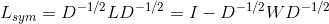
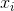

# 机器学习Algorithm

聚类

### kmeans

K-Means算法是一种无监督分类算法，假设有无标签数据集：

![X= \left[ \begin{matrix} x^{(1)} \\ x^{(2)} \\ \vdots \\ x^{(m)} \\ \end{matrix} \right]](https://math.jianshu.com/math?formula=X%3D%20%5Cleft%5B%20%5Cbegin%7Bmatrix%7D%20x%5E%7B(1)%7D%20%5C%5C%20x%5E%7B(2)%7D%20%5C%5C%20%5Cvdots%20%5C%5C%20x%5E%7B(m)%7D%20%5C%5C%20%5Cend%7Bmatrix%7D%20%5Cright%5D)

该算法的任务是将数据集聚类成个簇，最小化损失函数为：


其中为簇的中心点：


要找到以上问题的最优解需要遍历所有可能的簇划分，K-Mmeans算法使用贪心策略求得一个近似解，具体步骤如下：

1. 在样本中随机选取个样本点充当各个簇的中心点 

2. 计算所有样本点与各个簇中心之间的距离%7D%2C%5Cmu_%7Bj%7D))，然后把样本点划入最近的簇中%7D%5Cin%7B%5Cmu_%7Bnearest%7D%7D) 

3. 根据簇中已有的样本点，重新计算簇中心
     

4. 重复2、3

### **改进一——kmean++**


### **改进二——Kernel K-means**

​    设数据集，其中，。Mercer核函数，根据Mercer定理存在映射，使得。

​        核K-均值聚类就是讨论映射数据集在空间中的聚类情况，设在空间中，把数据集分为类，为第类的均值，。

即考虑以下模型：


。


**问题1：**

怎么训练上述模型，因为一般情况下是解不出来的。

方法：

初始化，，，其中，令

，。

**E步**：求，


注意其中：

，。

**M步：**固定，求。

，

,

，

其中**，。**

进入下一轮迭代，直至收敛！

### 改进三——ISODATA算法
​      **[1] 预期的聚类中心数目Ko**：虽然在ISODATA运行过程中聚类中心数目是可变的，但还是需要由用户指定一个参考标准。事实上，该算法的聚类中心数目变动范围也由**Ko**决定。具体地，最终输出的聚类中心数目范围是 [**Ko/2**, ***2Ko***]。

​       **[2] 每个类所要求的最少样本数目Nmin**：用于判断当某个类别所包含样本分散程度较大时是否可以进行分裂操作。如果分裂后会导致某个子类别所包含样本数目小于***Nmin***，就不会对该类别进行分裂操作。

​      **[3] 最大方差Sigma**：用于衡量某个类别中样本的分散程度。当样本的分散程度超过这个值时，则有可能进行分裂操作（注意同时需要满足**[2]**中所述的条件）。

​      **[4] 两个类别对应聚类中心之间所允许最小距离dmin**：如果两个类别靠得非常近（即这两个类别对应聚类中心之间的距离非常小），则需要对这两个类别进行合并操作。是否进行合并的阈值就是由***dmin***决定。

​      相信很多人看完上述输入的介绍后对ISODATA算法的流程已经有所猜测了。的确，ISODATA算法的原理非常直观，不过由于它和其他两个方法相比需要额外指定较多的参数，并且某些参数同样很难准确指定出一个较合理的值，因此ISODATA算法在实际过程中并没有K-means++受欢迎。

​      首先给出ISODATA算法主体部分的描述，如下图所示：

[](http://images2015.cnblogs.com/blog/1024143/201701/1024143-20170111025947447-390971451.png)

**图4. ISODATA算法的主体部分**

​     上面描述中没有说明清楚的是第5步中的分裂操作和第6步中的合并操作。下面首先介绍合并操作：

[](http://images2015.cnblogs.com/blog/1024143/201701/1024143-20170111025950760-1467458924.png)

**图5. ISODATA算法的合并操作**

​     最后是ISODATA算法中的分裂操作。

[](http://images2015.cnblogs.com/blog/1024143/201701/1024143-20170111025953056-677584793.png)

**图6. ISODATA算法的分裂操作**

​      最后，针对ISODATA算法总结一下：**该算法能够在聚类过程中根据各个类所包含样本的实际情况动态调整聚类中心的数目。如果某个类中样本分散程度较大（通过方差进行衡量）并且样本数量较大，则对其进行分裂操作；如果某两个类别靠得比较近（通过聚类中心的距离衡量），则对它们进行合并操作。**

​       可能没有表述清楚的地方是ISODATA-分裂操作的第1步和第2步。同样地以图三所示数据集为例，假设最初1，2，3，4，5，6，8号被分到了同一个类中，执行第1步和第2步结果如下所示：

[](http://images2015.cnblogs.com/blog/1024143/201701/1024143-20170111025954853-32277500.png)

​      而在正确分类情况下（即1，2，3，4为一类；5，6，7，8为一类），方差为0.33。因此，目前的方差远大于理想的方差，ISODATA算法就很有可能对其进行分裂操作。

### 改进对比

  (1) **K-means与K-means++：**原始K-means算法最开始随机选取数据集中K个点作为聚类中心，而K-means++按照如下的思想选取K个聚类中心：假设已经选取了n个初始聚类中心(0<n<K)，则在选取第n+1个聚类中心时：距离当前n个聚类中心越远的点会有更高的概率被选为第n+1个聚类中心。在选取第一个聚类中心(n=1)时同样通过随机的方法。可以说这也符合我们的直觉：聚类中心当然是互相离得越远越好。这个改进虽然直观简单，但是却非常得有效。

​      (2) **K-means与ISODATA：**ISODATA的全称是迭代自组织数据分析法。在K-means中，K的值需要预先人为地确定，并且在整个算法过程中无法更改。而当遇到高维度、海量的数据集时，人们往往很难准确地估计出K的大小。ISODATA就是针对这个问题进行了改进，它的思想也很直观：当属于某个类别的样本数过少时把这个类别去除，当属于某个类别的样本数过多、分散程度较大时把这个类别分为两个子类别。

​      (3) **K-means与Kernel K-means：**传统K-means采用欧式距离进行样本间的相似度度量，显然并不是所有的数据集都适用于这种度量方式。参照支持向量机中核函数的思想，将所有样本映射到另外一个特征空间中再进行聚类，就有可能改善聚类效果。

### **Mean-Shift 聚类**

1. 为了解释 mean-shift，我们将考虑一个二维空间中的点集，像上图所示那样。我们以一个圆心在C点（随机选择）的圆形滑窗开始，以半径 r 作为核。Mean shift 是一个爬山算法，它每一步都迭代地把核移动到更高密度的区域，直到收敛位置。
2. 在每次迭代时，通过移动中心点到滑窗中点的均值处，将滑窗移动到密度更高的区域（这也是这种算法名字的由来）。滑窗内的密度与在其内部点的数量成正比。很自然地，通过将中心移动到窗内点的均值处，可以逐步的移向有个高的密度的区域。
3. 我们继续根据均值来移动滑窗，直到有没有哪个方向可以使核中容纳更多的点。查看上面的图，我们一直移动圆圈直到密度不再增长。（即窗内点的数量不再增长）。
4. 用很多滑窗重复1-3这个过程，直到所有的点都包含在了窗内。当多个滑动窗口重叠时，包含最多点的窗口将被保留。然后，根据数据点所在的滑动窗口对数据点进行聚类。

下图展示了所有滑动窗口从端到端的整个过程。每个黑色的点都代表滑窗的质心，每个灰色的点都是数据点。


Mean-Shift 聚类的全部过程

与 K-means 聚类不同的是，Mean-Shift 不需要选择聚类的数量，因为mean-shift 自动发现它。这是一个很大的优点。事实上聚类中心向着有最大密度的点收敛也是我们非常想要的，因为这很容易理解并且很适合于自然的数据驱动的场景。缺点是滑窗尺寸/半径“r“的选择需要仔细考虑。

### DBSCAN

1. DBSCAN 从一个任意的还没有被访问过的启动数据点开始。用一个距离 epsilon ε 将这个点的邻域提取出来（所有再距离 ε 内的点都视为邻居点）。

2. 如果在邻域内有足够数量的点（根据 minPoints) ，那么聚类过程开始，并且当前数据点变成新集群中的第一个点。否则，该点将被标记为噪声（之后这个噪声点可能会变成集群中的一部分）。在这两种情况中的点都被标记为”已访问“。

3. 对于这个新集群中的第一个点，在它 ε 距离邻域内的点已将变成相同集群中的一部分。这个让所有在 ε 邻域内的点都属于相同集群的过程在之后会一直被重复做，直到所有新点都被加进集群分组中。

4. 第 2，3 步的过程会一直重复直到集群内所有点都被确定，即所有在 ε 邻域内的点都被访问且被打上标签。

5. 一旦我们在当前集群做完这些，一个新的未被访问的点会被提取并处理，从而会接着发现下一个集群或噪声。这个过程反复进行直到所有的点都被编辑为已访问。既然在最后所有的点都被访问，那么每个点都被标记为属于一个集群或者是噪声。

#### 优缺点

相较于其他聚类算法，DBSCAN 提出了一些很棒的优点。首先，它根本不需要预置集群的数量。它还将离群值认定为噪声，不像 mean-shift 中仅仅是将它们扔到一个集群里，甚至即使该数据点的差异性很大也这么做。另外，这个算法还可以很好的找到任意尺寸核任意形状的集群。

DBSCAN 最大的缺点是当集群的密度变化时，它表现的不像其他算法那样好。这是因为当密度变化时，距离的阈值 ε 和用于确定邻居点的 minPoints 也将会随之改变。这个缺点也会发生在很高为的数据中，因为距离阈值 ε 变得很难被估计。

### GMM

####一、GMM概述


#### 二、GMM算法步骤


#### 三、总结

1. GMM算法中间参数估计部分用到了EM算法，EM算法分为两步：

​      （1）E步：求目标函数期望，更多的是求目标函数取对数之后的期望值。

​      （2）M步：使期望最大化。用到极大似然估计，拉格朗日乘数法，对参数求偏导，最终确定新的参数。

2. K-means，FCM与GMM算法参数估计的数学推导思路大体一致，都先确立目标函数，然后使目标函数最大化的参数取值就是迭代公式。

3. 三个算法都需要事先指定k。K-means与FCM中的k指的是要聚的类的个数，GMM算法中的k指的是k个单高斯混合模型。

4. 三个算法流程一致：

​    （1）通过一定的方法初始化参数（eg:随机，均值······）

​    （2）确立目标函数

​    （3）通过一定的方法使目标函数最大化，更新参数迭代公式（eg:EM，粒子群······）

​    （4）设置一定的终止条件，使算法终止。若不满足条件，转向（3）

### 层次聚类

层次聚类算法分为两类：自上而下和自下而上。凝聚层级聚类(HAC)是自下而上的一种聚类算法。HAC首先将每个数据点视为一个单一的簇，然后计算所有簇之间的距离来合并簇，知道所有的簇聚合成为一个簇为止。
下图为凝聚层级聚类的一个实例：


具体步骤：

1. 首先我们将每个数据点视为一个单一的簇，然后选择一个测量两个簇之间距离的度量标准。例如我们使用average linkage作为标准，它将两个簇之间的距离定义为第一个簇中的数据点与第二个簇中的数据点之间的平均距离。

2. 在每次迭代中，我们将两个具有最小average linkage的簇合并成为一个簇。

3. 重复步骤2知道所有的数据点合并成一个簇，然后选择我们需要多少个簇。

层次聚类优点：（1）不需要知道有多少个簇 （2）对于距离度量标准的选择并不敏感


### 谱聚类

#### 1.1 谱和谱聚类

##### 1.1.1 谱

方阵作为线性算子，它的所有特征值的全体统称为方阵的谱。方阵的谱半径为最大的特征值。矩阵A的谱半径是矩阵的最大特征值。

##### 1.1.2 谱聚类

谱聚类是一种基于图论的聚类方法，通过对样本数据的拉普拉斯矩阵的特征向量进行聚类，从而达到对样本数据聚类的母的。谱聚类可以理解为将高维空间的数据映射到低维，然后在低维空间用其它聚类算法（如KMeans）进行聚类。

##### 1.2 谱聚类算法简单描述

输入：n个样本点和聚类簇的数目k；

输出：聚类簇

（1）使用下面公式计算的相似度矩阵W；

​                                 

W为组成的相似度矩阵。

（2）使用下面公式计算度矩阵D；

​                                ，即相似度矩阵W的每一行元素之和

D为组成的对角矩阵。

（3）计算拉普拉斯矩阵；

（4）计算L的特征值，将特征值从小到大排序，取前k个特征值，并计算前k个特征值的特征向量；

（5）将上面的k个列向量组成矩阵，；

（6）令是的第行的向量，其中；

（7）使用k-means算法将新样本点聚类成簇；

（8）输出簇，其中，.

上面就是未标准化的谱聚类算法的描述。也就是先根据样本点计算相似度矩阵，然后计算度矩阵和拉普拉斯矩阵，接着计算拉普拉斯矩阵前k个特征值对应的特征向量，最后将这k个特征值对应的特征向量组成的矩阵U，U的每一行成为一个新生成的样本点，对这些新生成的样本点进行k-means聚类，聚成k类，最后输出聚类的结果。这就是谱聚类算法的基本思想。相比较PCA降维中取前k大的特征值对应的特征向量，这里取得是前k小的特征值对应的特征向量。但是上述的谱聚类算法并不是最优的，接下来我们一步一步的分解上面的步骤，总结一下在此基础上进行优化的谱聚类的版本。

#### 1.3 谱聚类算法中的重要属性

##### 1.3.1 相似度矩阵介绍

相似度矩阵就是样本点中的任意两个点之间的距离度量，在聚类算法中可以表示为距离近的点它们之间的相似度比较高，而距离较远的点它们的相似度比较低，甚至可以忽略。这里用三种方式表示相似度矩阵：一是-近邻法（-neighborhood graph），二是k近邻法（k-nearest nerghbor graph），三是全连接法（fully connected graph）。下面我们来介绍这三种方法。

**（1）-neighborhood graph：**

​                                   ，表示样本点中任意两点之间的欧式距离

用此方法构造的相似度矩阵表示如下：

​                                  

该相似度矩阵由于距离近的点的距离表示为，距离远的点距离表示为0，矩阵种没有携带关于数据集的太多的信息，所以该方法一般很少使用，在sklearn中也没有使用该方法。

**（2）k-nearest nerghbor graph：**

由于每个样本点的k个近邻可能不是完全相同的，所以用此方法构造的相似度矩阵并不是对称的。因此，这里使用两种方式表示对称的knn相似度矩阵，第一种方式是如果在的k个领域中或者在的k个领域中，则为与之间的距离，否则为；第二种方式是如果在的k个领域中并且在的k个领域中，则为与之间的距离，否则为。很显然第二种方式比第一种方式生成的相似度矩阵要稀疏。这两种方式用公式表达如下：

第一种方式：

​                       

第二种方式：

​                      

**（3）fully connected graph:**

该方法就是在算法描述中的高斯相似度方法，公式如下：

​                     

该方法也是最常用的方法，在sklearn中默认的也是该方法，表示任意两个样本点都有相似度，但是距离较远的样本点之间相似度较低，甚至可以忽略。这里面的参数控制着样本点的邻域宽度，即越大表示样本点与距离较远的样本点的相似度越大，反之亦然。

##### 1.3.2 拉普拉斯矩阵介绍

对于谱聚类来说最重要的工具就是拉普拉斯矩阵了，下面我们来介绍拉普拉斯矩阵的三种表示方法。

**（1）未标准化的拉普拉斯矩阵：**

未标准化的拉普拉斯矩阵定义如下：

​                   

其中W是上节所说的相似度矩阵，D是度矩阵，在算法描述中有介绍。很显然，W与D都是对称矩阵。

未标准化的拉普拉斯矩阵L满足下面几个性质：

**（a）**对任意一个向量都有：

​                  

证明如下：

​               

​                          

**（b）**L是对称的和半正定的，证明如下：

因为，所以，所以为半正定矩阵。由于W和D都是对称矩阵，所以L为对称矩阵。

**（c）**L最小的特征值为0，且特征值0所对应的特征向量为全1向量，证明如下：

令表示的全1向量，则

​               

由D和W的定义可以得出上式。

**（d）**L有n个非负的实数特征值：

**（2）标准化拉普拉斯矩阵**

标准化拉普拉斯矩阵有两种表示方法，一是基于随机游走（Random Walk）的标准化拉普拉斯矩阵和对称标准化拉普拉斯矩阵，定义如下：

​              

​              

标准化的拉普拉斯矩阵满足如下性质：

**（a）**对任意一个向量都有：

​             

**（b）**当且仅当是的特征值，对应的特征向量为时，则是特征值，对应的特征向量为u；

**（c）**当且仅当时，是的特征值，对应的特征向量为u；

**（d）**0是的特征值，对应的特征向量为，为的全1向量；0也是的特征值，对应的特征向量为；

**（e）**和是半正定矩阵并且有非负实数特征值：.

关于各个版本的谱聚类算法的不同之处，就是在于相似度矩阵的计算方式不同和拉普拉斯矩阵的表示方法不同，其它步骤基本相同。下面就来介绍关于谱聚类的两个比较流行的标准化算法。

#### 1.4 标准化谱聚类算法介绍

##### 1.4.1 随机游走拉普拉斯矩阵的谱聚类算法描述

输入：n个样本点和聚类簇的数目k；

输出：聚类簇

（1）计算的相似度矩阵W；

（2）计算度矩阵D；

（3）计算拉普拉斯矩阵；

（4）计算的特征值，将特征值从小到大排序，取前k个特征值，并计算前k个特征值的特征向量；

（5）将上面的k个列向量组成矩阵，；

（6）令是的第行的向量，其中；

（7）使用k-means算法将新样本点聚类成簇；

（8）输出簇，其中，.

##### 2.4.2 对称拉普拉斯矩阵的谱聚类算法描述

输入：n个样本点和聚类簇的数目k；

输出：聚类簇

（1）计算的相似度矩阵W；

（2）计算度矩阵D；

（3）计算拉普拉斯矩阵；

（4）计算的特征值，将特征值从小到大排序，取前k个特征值，并计算前k个特征值的特征向量；

（5）将上面的k个列向量组成矩阵，；

（6）令是的第行的向量，其中；

（7）对于，将依次单位化，使得；

（8）使用k-means算法将新样本点聚类成簇；

（9）输出簇，其中，.

上面两个标准化拉普拉斯算法加上未标准化拉普拉斯算法这三个算法中，主要用到的技巧是将原始样本点转化为新的样本点，然后再对新样本点使用其它的聚类算法进行聚类，在这里最后一步用到的聚类算法不一定非要是KMeans算法，也可以是其它的聚类算法，具体根据实际情况而定。在sklearn中默认是使用KMeans算法，但是由于KMeans聚类对初始聚类中心的选择比较敏感，从而导致KMeans算法不稳定，进而导致谱聚类算法不稳定，所以在sklearn中有另外一个可选项是'discretize'，该算法对初始聚类中心的选择不敏感。

### 2. 谱聚类算法的优缺点

#### 2.1 优点

（1）当聚类的类别个数较小的时候，谱聚类的效果会很好，但是当聚类的类别个数较大的时候，则不建议使用谱聚类；

（2）谱聚类算法使用了降维的技术，所以更加适用于高维数据的聚类；

（3）谱聚类只需要数据之间的相似度矩阵，因此对于处理稀疏数据的聚类很有效。这点传统聚类算法（比如K-Means）很难做到

（4）谱聚类算法建立在谱图理论基础上，与传统的聚类算法相比，它具有能在任意形状的样本空间上聚类且收敛于全局最优解

#### 2.2 缺点

（1）谱聚类对相似度图的改变和聚类参数的选择非常的敏感；

（2）谱聚类适用于均衡分类问题，即各簇之间点的个数相差不大，对于簇之间点个数相差悬殊的聚类问题，谱聚类则不适用；

## 插值

### 1、最近邻插值算法（零阶插值算法）

目标图像B（X,Y）通过同时求得源图像A（x+u,y+v）（u，v是<=1的小数），则对应在源图像上的坐标为A（x,y）=A（i,j）,所以要找邻近的4个像素点：


> 如果 i+u, j+v(i落在 A区，即 u<0.5,v<0.5，则将左上角象素的灰度值赋给待求象素，同理落在B区则赋予右上角的象素灰度值，落在C区则赋予左下角象素的灰度值，落在D区则赋予右下角象素的灰度值。
> 最近邻插值法计算量较小，但可能会造成生的图像灰度上的不连续，在变化地方可能出现明显锯齿状。

近邻取样插值缩放简单、速度快，但是缩放出的图片质量比较差，当图片放大时，缺少的像素通过直接使用与之最近原有颜色生成，也就是说照搬旁边的像素这样做结果产生了明显可见的锯齿。效果不好的根源就是其简单的最临近插值方法引入了严重的图像失真，比如，当由目标图的坐标反推得到的源图的的坐标是一个浮点数的时候，采用了四舍五入的方法，直接采用了和这个浮点数最接近的象素的值，这种方法是很不科学的。

### 2、双线性（一阶插值法）

经过三次插值才能得到最终结果，是对最近邻的改进。先对两水平方向进行一阶线性插值，然后再在垂直方向上进行一阶线性插值。能创造出比双线性插值更平滑的图像边缘。

#### 单线性插值


相当于在y=y0和y=y1这两个值上做了线性的插值。

#### 双线性插值

双线性插值是**有两个变量的插值函数的线性插值扩展**，在两个方向分别进行一次线性插值。


假如想得到未知函数f在p点的值，已经知道了f在Q11 = (x1, y1)、Q12 = (x1, y2), Q21(x2, y1) 以及 Q22(x2, y2) 四个点的值。

首先在x方向进行两次线性插值：


然后在 y 方向进行一次线性插值：


图像双线性插值只会用相邻的4个点，opencv中用了一些优化手段，比如用整数计算代替float，源图像和目标图像几何中心的对齐。

假设源图像A大小为m*n，像素坐标为（x，y），缩放后的目标图像大小是M*N，依次求B（X，Y）每一个像素点的值，先找到B（X,Y）对应在A（x，y）的坐标：

x = X * （m/M）

y = Y * （n/N）

中心对齐(OpenCV也是如此)： 

```
SrcX=(dstX+0.5) * (srcWidth/dstWidth) -0.5` 
`SrcY=(dstY+0.5) * (srcHeight/dstHeight)-0.5
```

源图像和目标图像的原点（0，0）均选择左上角，假设你需要将一幅5x5的图像缩小成3x3，那么源图像和目标图像各个像素之间的对应关系如下。如果没有这个两个图像的几何中心对齐，根据基本公式去算，就会发现源图像中最右边和最下边上的像素没有参与运算，输出图像的像素点的灰度值相对于源图像偏，就会得到左边这样的结果；而用了对齐，就会得到右边的结果： 


#### 效果分析

效果好于最近邻插值，计算量稍大，放缩后图像质量提高，基本克服了最近邻插值灰度值不连续的缺点，但是由于只考虑了相邻的4个点，没有考虑各个点之间灰度值的变化率的影响，因此具有低通滤波的作用，知道图像的高频分量受到影响，图像边缘在一定程度上变得模糊。

### 3、立方卷积插值算法（双三次、双立方）

是对双线性插值的改进，是一种较为复杂的插值方式，它不仅考虑到相邻的4*4像素点灰度值的影响，还考虑到它们灰度值变化率的影响。

#### 卷积插值公式

假设P（x+u，y+v）点就是（x，y）对应在目标图像的位置，双立方差值就是通过bicubic基函数得到目标像素点周围的16个相邻像素目标像素点P的影响因子，该**基函数（卷积插值公式）**是：


> a=-0.5时比较合适
>
> x位在目标图像中相邻的16个像素到P的距离。

##### a=-1时


此时逼近的函数是y = sin(x*π)/(x*π)：


##### 当a=-0.5[ ](https://en.wikipedia.org/wiki/Cubic_Hermite_spline)


此时逼近[三次Hermite样条](https://en.wikipedia.org/wiki/Cubic_Hermite_spline)：


##### 对比图


##### 过程

假设源图像A大小为m*n，像素坐标为（x，y），缩放后的目标图像大小是M*N，依次求B（X，Y）每一个像素点的值，先找到B（X,Y）对应在A的坐标（x+u,y+v），因为计算出来的不可能肯定是整数，所以这样表示，然后找找到最接近的点就是A(x,y)，最终B(X,Y)的像素值就是由A(x,y)附近的16个像素点来决定，这十六个像素点的范围是：


 

设像素点的像素值的函数是f(x,y)，那么目标图像B中对应的像素点（X,Y）的像素值为F(x+u,y+v)：


> S（x）就是卷积插值公式W（x）。
>
> a取-0.5

矩阵形式：


#### 效果分析

立方卷积插值不仅考虑到周围四个直接相邻像素点灰度值的影响，还考虑到它们灰度值变化率的影响。因此克服了前两种方法的不足之处，能够产生比双线性插值更为平滑的边缘，计算精度很高，处理后的图像像质损失最少，效果是最佳的。

### 4.多项式插值（得到的是经过所有点的一个插值函数）**

**①一般多项式插值**

****

****

**②.拉格朗日插值法**

****

****

****

****

**③.牛顿插值法**

****

****

****

多项式插值存在的问题：

龙格现象：当函数的次数过高时，xi加大一点对函数值的影响就会很大。

****

****

为了解决龙格现象，引入了分段插值。

**2.分段插值（非得到一个插值函数，而是用很多分段插值函数求每个分段上的xi的函数值）**

****

****

**①埃尔米特插值：不仅函数值相等，而且一阶导数相等**

****

****

 

**②分段三次埃尔米特插值**

****

**③三次样条插值：二阶导数连续可微**

****

对比：

****

 

**n维插值问题：（同一维插值）**

****

 

## 拟合


## 数据预测


## 分类

## 异常检测

## 跟踪

## 滤波

## 控制

## 关联

## 推荐