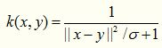
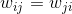
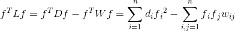
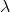
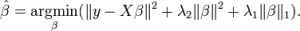
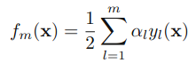

# 机器学习Algorithm

## 基础

### 范数

范数(norm)是数学中的一种基本概念，是具有“长度”概念的函数。
  在泛函分析中，它定义在赋范线性空间中，并满足一定的条件，即①非负性；②齐次性；③三角不等式。它常常被用来度量某个向量空间（或矩阵）中的每个向量的长度或大小。
  在线性代数、泛函分析及相关的数学领域，范数是一个函数，是矢量空间内的所有矢量赋予非零的正长度或大小。半范数可以为非零的矢量赋予零长度。


#### 常见范数

##### 1向量范数

通俗的理解，向量范数就是在这个向量空间中向量的大小
一般向量范数常使用L-P范数
其通用公式为：

注意，上述公式中Xi外应该有绝对值符号。
聪明的你应该已经发现了：
  L0范数表示向量中非零元素个数

  L1范数表示向量元素绝对值之和，L1范数有很多的名字，例如我们熟悉的曼哈顿距离、最小绝对误差等。使用L1范数可以度量两个向量间的差异，如绝对误差和（Sum of Absolute Difference）
  由于L1范数的天然性质，对L1优化的解是一个稀疏解，因此L1范数也被叫做稀疏规则算子。通过L1可以实现特征的稀疏，去掉一些没有信息的特征，例如在对用户的电影爱好做分类的时候，用户有100个特征，可能只有十几个特征是对分类有用的，大部分特征如身高体重等可能都是无用的，利用L1范数就可以过滤掉。

  L2范数让人想到欧几里得距离，L2范数通常会被用来做优化目标函数的正则化项，防止模型为了迎合训练集而过于复杂造成过拟合的情况，从而提高模型的泛化能力。

  L∞通常用来度量元素的最大值。

##### 2 矩阵范数

矩阵可以看作向量空间上的一次向量的线性变换，矩阵范数就是用来衡量变化幅度大小的。

###### 2.1 诱导范数

由向量范数的L-P范数诱导而来，故曰诱导范数

列和范数，即所有矩阵列向量绝对值之和的最大值

谱范数，即ATA矩阵的最大特征值的开平方。（快去复习矩阵特征值怎么求）

行和范数，即所有矩阵行向量绝对值之和的最大值。

###### 2.2 非诱导范数


Frobenius范数，即矩阵元素绝对值的平方和再开平方（**上图公式漏了绝对值的平方，百度害人**）

核范数，是指矩阵奇异值的和（快去复习什么叫矩阵奇异值）


##### 常用的核函数：

1. Linear Kernel
   线性核是最简单的核函数，核函数的数学公式如下：


如果我们将线性核函数应用在KPCA中，我们会发现，推导之后和原始PCA算法一模一样，很多童鞋借此说“kernel is shit！！！”，这是不对的，这只是线性核函数偶尔会出现等价的形式罢了。

2. Polynomial Kernel
   多项式核实一种非标准核函数，它非常适合于正交归一化后的数据，其具体形式如下：


这个核函数是比较好用的，就是参数比较多，但是还算稳定。

3. Gaussian Kernel
   这里说一种经典的鲁棒径向基核，即高斯核函数，鲁棒径向基核对于数据中的噪音有着较好的抗干扰能力，其参数决定了函数作用范围，超过了这个范围，数据的作用就“基本消失”。高斯核函数是这一族核函数的优秀代表，也是必须尝试的核函数，其数学形式如下：


虽然被广泛使用，但是这个核函数的性能对参数十分敏感，以至于有一大把的文献专门对这种核函数展开研究，同样，高斯核函数也有了很多的变种，如指数核，拉普拉斯核等。

4. Exponential Kernel
   指数核函数就是高斯核函数的变种，它仅仅是将向量之间的L2距离调整为L1距离，这样改动会对参数的依赖性降低，但是适用范围相对狭窄。其数学形式如下：


5. Laplacian Kernel
   拉普拉斯核完全等价于指数核，唯一的区别在于前者对参数的敏感性降低，也是一种径向基核函数。


6. ANOVA Kernel
   ANOVA 核也属于径向基核函数一族，其适用于多维回归问题，数学形式如下：


7. Sigmoid Kernel
   Sigmoid 核来源于神经网络，现在已经大量应用于深度学习，是当今机器学习的宠儿，它是S型的，所以被用作于“激活函数”。关于这个函数的性质可以说好几篇文献，大家可以随便找一篇深度学习的文章看看。


8. Rational Quadratic Kernel
   二次有理核完完全全是作为高斯核的替代品出现，如果你觉得高斯核函数很耗时，那么不妨尝试一下这个核函数，顺便说一下，这个核函数作用域虽广，但是对参数十分敏感，慎用！！！！


9. Multiquadric Kernel
   多元二次核可以替代二次有理核，它是一种非正定核函数。


10. Inverse Multiquadric Kernel
    顾名思义，逆多元二次核来源于多元二次核，这个核函数我没有用过，但是据说这个基于这个核函数的算法，不会遇到核相关矩阵奇异的情况。


 

11. Circular Kernel
    这个核函数没有用过，其数学形式如下所示：


 

12. Spherical Kernel
    这个核函数是上一个的简化版，形式如下所示


13. Wave Kernel
    这个核函数没有用过，其适用于语音处理场景。


14. Triangular Kernel
    三角核函数感觉就是多元二次核的特例，数学公式如下：


15. Log Kernel
    对数核一般在图像分割上经常被使用，数学形式如下：


16. Spline Kernel


17. Bessel Kernel


18. Cauchy Kernel
    柯西核来源于神奇的柯西分布，与柯西分布相似，函数曲线上有一个长长的尾巴，说明这个核函数的定义域很广泛，言外之意，其可应用于原始维度很高的数据上。



19. Chi-Square Kernel
    卡方核，这是我最近在使用的核函数，让我欲哭无泪，在多个数据集上都没有用，竟然比原始算法还要差劲，不知道为什么文献作者首推这个核函数，其来源于卡方分布，数学形式如下：


它存在着如下变种：


其实就是上式减去一项得到的产物，这个核函数基于的特征不能够带有赋值，否则性能会急剧下降，如果特征有负数，那么就用下面这个形式：


20. Histogram Intersection Kernel
    直方图交叉核在图像分类里面经常用到，比如说人脸识别，适用于图像的直方图特征，例如extended LBP特征其数学形式如下，形式非常的简单


21. Generalized Histogram Intersection
    顾名思义，广义直方图交叉核就是上述核函数的拓展，形式如下：


22. Generalized T-Student Kernel
    TS核属于mercer核，其数学形式如下，这个核也是经常被使用的


### 激活函数

#### 1. Sigmoid激活函数

- 函数表达式：

​      

- 函数图像：


- 优点：Sigmoid激活函数是应用范围最广的一类激活函数，具有指数形状，它在物理意义上最为接近生物神经元。另外，Sigmoid的输出是`(0,1)`，具有很好的性质，可以被表示为概率或者用于输入的归一化等。可以看出，Sigmoid函数连续，光滑，严格单调，以`(0,0.5)`中心对称，是一个非常良好的阈值函数。当`x`趋近负无穷时，`y`趋近于`0`；`x`趋近于正无穷时，`y`趋近于`1`；`x=0`时，`y=0.5`。当然，在`x`超出`[-6,6]`的范围后，函数值基本上没有变化，值非常接近，在应用中一般不考虑。Sigmoid函数的导数是其本身的函数，即`f′(x)=f(x)(1−f(x))`，计算非常方便，也非常节省计算时间。
- 缺点：Sigmoid最明显的缺点就是饱和性。从曲线图中看到，其两侧的导数逐渐趋近于`0`，即：limx->∞f'(x)=0 。我们将具有这种性质的激活函数叫作软饱和激活函数。具体的，饱和又可分为左饱和与右饱和。与软饱和对应的是硬饱和, 即`f′(x)=0`，当`|x|>c`，其中`c`为常数。sigmoid 的软饱和性，使得深度神经网络在二三十年里一直难以有效的训练，是阻碍神经网络发展的重要原因。另外，Sigmoid函数的输出均大于`0`，使得输出不是`0`均值，这称为偏移现象，这会导致后一层的神经元将得到上一层输出的非`0`均值的信号作为输入。

#### 2. TanH

- 函数表达式：


 

-  *函数图像：*


 

- 导数：


 

 

 

- 优点：与Sigmoid相比，它的输出均值是`0`，使得其收敛速度要比Sigmoid快，减少迭代次数。
- 缺点：该导数在正负饱和区的梯度都会接近于`0`值(仍然具有软饱和性)，会造成梯度消失。还有其更复杂的幂运算。

#### 3. ReLU

- 函数表达式：

 

- *函数图像：*


 

 

- 导数：当 x>0 时， f'(x)=1 ,当 x<0 时 f'(x)=0 。
- 优点：ReLU的全称是Rectified Linear Units，是一种AlexNet时期才出现的激活函数。可以看到，当`x<0`时，ReLU硬饱和，而当`x>0`时，则不存在饱和问题。所以，ReLU 能够在`x>0`时保持梯度不衰减，从而缓解梯度消失问题。这让我们能够直接以监督的方式训练深度神经网络，而无需依赖无监督的逐层预训练。
- 缺点：随着训练的推进，部分输入会落入硬饱和区，导致对应权重无法更新。这种现象被称为“神经元死亡”。与Sigmoid类似，ReLU的输出均值也大于`0`，偏移现象和神经元死亡会共同影响网络的收敛性。

#### 4. Leaky ReLU & PReLU

- 函数表达式和导数：


 

 

- 函数图像：


- 特点：为了改善ReLU在  x<0  时梯度为  0造成Dead ReLU，提出了Leaky ReLU使得这一问题得到了缓解。例如在我们耳熟能详的YOLOV3网络中就使用了Leaky ReLU这一激活函数，一般 α取  0.25。另外PReLU就是将Leaky ReLU公式里面的 α当成可学习参数参与到网络训练中。

#### 5. ReLU6

- 函数表达式：


- 特点：ReLU6就是普通的ReLU但是限制最大输出值为`6`（对输出值做`clip`），这是为了在移动端设备`float16`的低精度的时候，也能有很好的数值分辨率，如果对ReLU的激活范围不加限制，输出范围为 0到正无穷，如果激活值非常大，分布在一个很大的范围内，则低精度的`float16`无法很好地精确描述如此大范围的数值，带来精度损失。

#### 6. ELU

- 函数表达式：


 

 

- 函数图像：


- 导数：当 x>0 时， f'(x)=1 ，当 x<0 时， f'(x)=αex 。
- 特点：融合了sigmoid和ReLU，左侧具有软饱和性，右侧无饱和性。右侧线性部分使得ELU能够缓解梯度消失，而左侧软饱能够让ELU对输入变化或噪声更鲁棒。ELU的输出均值接近于零，所以收敛速度更快。在 ImageNet上，不加Batch Normalization 30层以上的ReLU网络会无法收敛，PReLU网络在MSRA的Fan-in （caffe ）初始化下会发散，而 ELU 网络在Fan-in/Fan-out下都能收敛。

#### 7. SoftSign

- 函数表达式：


- 函数图像：


 

 

- 导数：图中已经求出。
- 特点：Softsign是tanh激活函数的另一个替代选择，从图中可以看到它和tanh的曲线极其相似，不过相比于tanh，**Softsign的曲线更平坦，导数下降的更慢一点，这个特性使得它可以缓解梯度消失问题，可以更高效的学习。**

#### 8. SoftPlus

- 函数表达式：


 

 

- 函数图像：


 

 

- 函数导数：SoftPlus激活函数的导数恰好就是sigmoid激活函数，即 f'(x)=sigmoid(x) 。
- 优点：**SoftPlus可以作为ReLu的一个不错的替代选择，可以看到与ReLU不同的是，SoftPlus的导数是连续的、非零的、无处不在的，这一特性可以防止出现ReLU中的“神经元死亡”现象。**
- 缺点：**SoftPlus是不对称的，不以0为中心，存在偏移现象；而且，由于其导数常常小于1，也可能会出现梯度消失的问题。**

#### 9. SELU

- 函数表达式： SELU(x)=λ*ELU(x) ，也即是：


- 特点：这个激活函数来自论文：https://arxiv.org/abs/1706.02515 。而这篇论文就是提出了这一激活函数，然后论文写了93页公式来证明**只需要把激活函数换成SELU就能使得输入在经过一定层数之后变成固定的分布**。。而这个函数实际上就是在ELU激活函数的基础上乘以了一个 λ ，但需要注意的是这个 λ是大于 1的。

#### 10. Swish

- 函数表达式： f(x) = x*sigmoid(x) ，其中 β 是个常数或可训练的参数.Swish 具备无上界有下界、平滑、非单调的特性。
- 函数图像：


 

- 函数导数


- 特点：**Swish 在深层模型上的效果优于 ReLU**。例如，仅仅使用 Swish 单元替换 ReLU 就能把 **Mobile NASNetA** 在 ImageNet 上的 top-1 分类准确率提高  0.9% ，**Inception-ResNet-v**的分类准确率提高  0.6% 。当 β=0 时，Swish激活函数变成线性函数 f(x)=x/2 .而当 β->∞ 时， δ（x）=(1+exp(-x))-1 为0或1,这个时候Swish激活函数变成ReLU激活函数 f(x)=2max(0,x) 。因此Swish激活函数可以看做是介于线性函数与ReLU函数之间的平滑函数。

#### 11. Maxout

- 函数表达式：


 

 

- *特点： Maxout 模型实际上也是一种新型的激活函数，在前馈式神经网络中， Maxout 的输出即取该层的最大值，在卷积神经网络中，一个 Maxout 特征图可以是由***多个特征图取最值得到***。 Maxout 的拟合能力是非常强的，它可以拟合任意的的凸函数。但是它又和* Dropout 一样需要人为设定一个 k 值。为了便于理解，假设有一个在第 i 层有 2 个节点， i+1 层有1个节点构成的神经网络。即：


 

 

- 激活值 out = f(W*X+b) ，其中 f是激活函数， *在这里代表內积。然后 X=(x1,x2)T ， W=(w1,w2)T 。那么当我们对 i层使用 Maxout （设定 k=5 ）然后再输出的时候，情况就发生了改变。网络就变成了：


 

-  此时网络形式上就变成上面的样子，用公式表现出来就是： z1=W1*X+b1 ， z2=W2*X+b2 ， z3=W3*X+b3 ， z4=W4*X+b4 ， z5=W5*X+b5 。 out=max(z1,z2,z3,z4,z5) 也就是说第层的激活值计算了5次，可我们明明只需要 1个激活值，那么我们该怎么办？其实上面的叙述中已经给出了答案，取这 5个的最大值来作为最终的结果。
- 可以看到采用 Maxout 的话参数个数也增加了 k倍，计算开销会增大。

#### 12. Mish

- 函数表达式：


 

 

 

- 函数图像：


- 特点：这个激活函数是最新的SOTA激活函数。论文中提到，以上无边界(即正值可以达到任何高度)避免了由于封顶而导致的饱和，理论上对负值的轻微允许更好的梯度流，而不是像ReLU中那样的硬零边界，并且整个损失函数仍然保持了平滑性。

## 聚类

### kmeans

K-Means算法是一种无监督分类算法，假设有无标签数据集：

![X= \left[ \begin{matrix} x^{(1)} \\ x^{(2)} \\ \vdots \\ x^{(m)} \\ \end{matrix} \right]](https://math.jianshu.com/math?formula=X%3D%20%5Cleft%5B%20%5Cbegin%7Bmatrix%7D%20x%5E%7B(1)%7D%20%5C%5C%20x%5E%7B(2)%7D%20%5C%5C%20%5Cvdots%20%5C%5C%20x%5E%7B(m)%7D%20%5C%5C%20%5Cend%7Bmatrix%7D%20%5Cright%5D)

该算法的任务是将数据集聚类成个簇，最小化损失函数为：


其中为簇的中心点：


要找到以上问题的最优解需要遍历所有可能的簇划分，K-Mmeans算法使用贪心策略求得一个近似解，具体步骤如下：

1. 在样本中随机选取个样本点充当各个簇的中心点 

2. 计算所有样本点与各个簇中心之间的距离%7D%2C%5Cmu_%7Bj%7D))，然后把样本点划入最近的簇中%7D%5Cin%7B%5Cmu_%7Bnearest%7D%7D) 

3. 根据簇中已有的样本点，重新计算簇中心
     

4. 重复2、3

### **改进一——kmean++**


### **改进二——Kernel K-means**

​    设数据集，其中，。Mercer核函数，根据Mercer定理存在映射，使得。

​        核K-均值聚类就是讨论映射数据集在空间中的聚类情况，设在空间中，把数据集分为类，为第类的均值，。

即考虑以下模型：


。


**问题1：**

怎么训练上述模型，因为一般情况下是解不出来的。

方法：

初始化，，，其中，令

，。

**E步**：求，


注意其中：

，。

**M步：**固定，求。

，

,

，

其中**，。**

进入下一轮迭代，直至收敛！

### 改进三——ISODATA算法
​      **[1] 预期的聚类中心数目Ko**：虽然在ISODATA运行过程中聚类中心数目是可变的，但还是需要由用户指定一个参考标准。事实上，该算法的聚类中心数目变动范围也由**Ko**决定。具体地，最终输出的聚类中心数目范围是 [**Ko/2**, ***2Ko***]。

​       **[2] 每个类所要求的最少样本数目Nmin**：用于判断当某个类别所包含样本分散程度较大时是否可以进行分裂操作。如果分裂后会导致某个子类别所包含样本数目小于***Nmin***，就不会对该类别进行分裂操作。

​      **[3] 最大方差Sigma**：用于衡量某个类别中样本的分散程度。当样本的分散程度超过这个值时，则有可能进行分裂操作（注意同时需要满足**[2]**中所述的条件）。

​      **[4] 两个类别对应聚类中心之间所允许最小距离dmin**：如果两个类别靠得非常近（即这两个类别对应聚类中心之间的距离非常小），则需要对这两个类别进行合并操作。是否进行合并的阈值就是由***dmin***决定。

​      相信很多人看完上述输入的介绍后对ISODATA算法的流程已经有所猜测了。的确，ISODATA算法的原理非常直观，不过由于它和其他两个方法相比需要额外指定较多的参数，并且某些参数同样很难准确指定出一个较合理的值，因此ISODATA算法在实际过程中并没有K-means++受欢迎。

​      首先给出ISODATA算法主体部分的描述，如下图所示：

[](http://images2015.cnblogs.com/blog/1024143/201701/1024143-20170111025947447-390971451.png)

**图4. ISODATA算法的主体部分**

​     上面描述中没有说明清楚的是第5步中的分裂操作和第6步中的合并操作。下面首先介绍合并操作：

[](http://images2015.cnblogs.com/blog/1024143/201701/1024143-20170111025950760-1467458924.png)

**图5. ISODATA算法的合并操作**

​     最后是ISODATA算法中的分裂操作。

[](http://images2015.cnblogs.com/blog/1024143/201701/1024143-20170111025953056-677584793.png)

**图6. ISODATA算法的分裂操作**

​      最后，针对ISODATA算法总结一下：**该算法能够在聚类过程中根据各个类所包含样本的实际情况动态调整聚类中心的数目。如果某个类中样本分散程度较大（通过方差进行衡量）并且样本数量较大，则对其进行分裂操作；如果某两个类别靠得比较近（通过聚类中心的距离衡量），则对它们进行合并操作。**

​       可能没有表述清楚的地方是ISODATA-分裂操作的第1步和第2步。同样地以图三所示数据集为例，假设最初1，2，3，4，5，6，8号被分到了同一个类中，执行第1步和第2步结果如下所示：

[](http://images2015.cnblogs.com/blog/1024143/201701/1024143-20170111025954853-32277500.png)

​      而在正确分类情况下（即1，2，3，4为一类；5，6，7，8为一类），方差为0.33。因此，目前的方差远大于理想的方差，ISODATA算法就很有可能对其进行分裂操作。

### 改进对比

  (1) **K-means与K-means++：**原始K-means算法最开始随机选取数据集中K个点作为聚类中心，而K-means++按照如下的思想选取K个聚类中心：假设已经选取了n个初始聚类中心(0<n<K)，则在选取第n+1个聚类中心时：距离当前n个聚类中心越远的点会有更高的概率被选为第n+1个聚类中心。在选取第一个聚类中心(n=1)时同样通过随机的方法。可以说这也符合我们的直觉：聚类中心当然是互相离得越远越好。这个改进虽然直观简单，但是却非常得有效。

​      (2) **K-means与ISODATA：**ISODATA的全称是迭代自组织数据分析法。在K-means中，K的值需要预先人为地确定，并且在整个算法过程中无法更改。而当遇到高维度、海量的数据集时，人们往往很难准确地估计出K的大小。ISODATA就是针对这个问题进行了改进，它的思想也很直观：当属于某个类别的样本数过少时把这个类别去除，当属于某个类别的样本数过多、分散程度较大时把这个类别分为两个子类别。

​      (3) **K-means与Kernel K-means：**传统K-means采用欧式距离进行样本间的相似度度量，显然并不是所有的数据集都适用于这种度量方式。参照支持向量机中核函数的思想，将所有样本映射到另外一个特征空间中再进行聚类，就有可能改善聚类效果。

### **Mean-Shift 聚类**

1. 为了解释 mean-shift，我们将考虑一个二维空间中的点集，像上图所示那样。我们以一个圆心在C点（随机选择）的圆形滑窗开始，以半径 r 作为核。Mean shift 是一个爬山算法，它每一步都迭代地把核移动到更高密度的区域，直到收敛位置。
2. 在每次迭代时，通过移动中心点到滑窗中点的均值处，将滑窗移动到密度更高的区域（这也是这种算法名字的由来）。滑窗内的密度与在其内部点的数量成正比。很自然地，通过将中心移动到窗内点的均值处，可以逐步的移向有个高的密度的区域。
3. 我们继续根据均值来移动滑窗，直到有没有哪个方向可以使核中容纳更多的点。查看上面的图，我们一直移动圆圈直到密度不再增长。（即窗内点的数量不再增长）。
4. 用很多滑窗重复1-3这个过程，直到所有的点都包含在了窗内。当多个滑动窗口重叠时，包含最多点的窗口将被保留。然后，根据数据点所在的滑动窗口对数据点进行聚类。

下图展示了所有滑动窗口从端到端的整个过程。每个黑色的点都代表滑窗的质心，每个灰色的点都是数据点。


Mean-Shift 聚类的全部过程

与 K-means 聚类不同的是，Mean-Shift 不需要选择聚类的数量，因为mean-shift 自动发现它。这是一个很大的优点。事实上聚类中心向着有最大密度的点收敛也是我们非常想要的，因为这很容易理解并且很适合于自然的数据驱动的场景。缺点是滑窗尺寸/半径“r“的选择需要仔细考虑。

### DBSCAN

1. DBSCAN 从一个任意的还没有被访问过的启动数据点开始。用一个距离 epsilon ε 将这个点的邻域提取出来（所有再距离 ε 内的点都视为邻居点）。

2. 如果在邻域内有足够数量的点（根据 minPoints) ，那么聚类过程开始，并且当前数据点变成新集群中的第一个点。否则，该点将被标记为噪声（之后这个噪声点可能会变成集群中的一部分）。在这两种情况中的点都被标记为”已访问“。

3. 对于这个新集群中的第一个点，在它 ε 距离邻域内的点已将变成相同集群中的一部分。这个让所有在 ε 邻域内的点都属于相同集群的过程在之后会一直被重复做，直到所有新点都被加进集群分组中。

4. 第 2，3 步的过程会一直重复直到集群内所有点都被确定，即所有在 ε 邻域内的点都被访问且被打上标签。

5. 一旦我们在当前集群做完这些，一个新的未被访问的点会被提取并处理，从而会接着发现下一个集群或噪声。这个过程反复进行直到所有的点都被编辑为已访问。既然在最后所有的点都被访问，那么每个点都被标记为属于一个集群或者是噪声。

#### 优缺点

相较于其他聚类算法，DBSCAN 提出了一些很棒的优点。首先，它根本不需要预置集群的数量。它还将离群值认定为噪声，不像 mean-shift 中仅仅是将它们扔到一个集群里，甚至即使该数据点的差异性很大也这么做。另外，这个算法还可以很好的找到任意尺寸核任意形状的集群。

DBSCAN 最大的缺点是当集群的密度变化时，它表现的不像其他算法那样好。这是因为当密度变化时，距离的阈值 ε 和用于确定邻居点的 minPoints 也将会随之改变。这个缺点也会发生在很高为的数据中，因为距离阈值 ε 变得很难被估计。

### GMM

####一、GMM概述


#### 二、GMM算法步骤


#### 三、总结

1. GMM算法中间参数估计部分用到了EM算法，EM算法分为两步：

​      （1）E步：求目标函数期望，更多的是求目标函数取对数之后的期望值。

​      （2）M步：使期望最大化。用到极大似然估计，拉格朗日乘数法，对参数求偏导，最终确定新的参数。

2. K-means，FCM与GMM算法参数估计的数学推导思路大体一致，都先确立目标函数，然后使目标函数最大化的参数取值就是迭代公式。

3. 三个算法都需要事先指定k。K-means与FCM中的k指的是要聚的类的个数，GMM算法中的k指的是k个单高斯混合模型。

4. 三个算法流程一致：

​    （1）通过一定的方法初始化参数（eg:随机，均值······）

​    （2）确立目标函数

​    （3）通过一定的方法使目标函数最大化，更新参数迭代公式（eg:EM，粒子群······）

​    （4）设置一定的终止条件，使算法终止。若不满足条件，转向（3）

### 层次聚类

层次聚类算法分为两类：自上而下和自下而上。凝聚层级聚类(HAC)是自下而上的一种聚类算法。HAC首先将每个数据点视为一个单一的簇，然后计算所有簇之间的距离来合并簇，知道所有的簇聚合成为一个簇为止。
下图为凝聚层级聚类的一个实例：


具体步骤：

1. 首先我们将每个数据点视为一个单一的簇，然后选择一个测量两个簇之间距离的度量标准。例如我们使用average linkage作为标准，它将两个簇之间的距离定义为第一个簇中的数据点与第二个簇中的数据点之间的平均距离。

2. 在每次迭代中，我们将两个具有最小average linkage的簇合并成为一个簇。

3. 重复步骤2知道所有的数据点合并成一个簇，然后选择我们需要多少个簇。

层次聚类优点：（1）不需要知道有多少个簇 （2）对于距离度量标准的选择并不敏感


### 谱聚类

#### 1.1 谱和谱聚类

##### 1.1.1 谱

方阵作为线性算子，它的所有特征值的全体统称为方阵的谱。方阵的谱半径为最大的特征值。矩阵A的谱半径是矩阵的最大特征值。

##### 1.1.2 谱聚类

谱聚类是一种基于图论的聚类方法，通过对样本数据的拉普拉斯矩阵的特征向量进行聚类，从而达到对样本数据聚类的母的。谱聚类可以理解为将高维空间的数据映射到低维，然后在低维空间用其它聚类算法（如KMeans）进行聚类。

##### 1.2 谱聚类算法简单描述

输入：n个样本点和聚类簇的数目k；

输出：聚类簇

（1）使用下面公式计算的相似度矩阵W；

​                                 

W为组成的相似度矩阵。

（2）使用下面公式计算度矩阵D；

​                                ，即相似度矩阵W的每一行元素之和

D为组成的对角矩阵。

（3）计算拉普拉斯矩阵；

（4）计算L的特征值，将特征值从小到大排序，取前k个特征值，并计算前k个特征值的特征向量；

（5）将上面的k个列向量组成矩阵，；

（6）令是的第行的向量，其中；

（7）使用k-means算法将新样本点聚类成簇；

（8）输出簇，其中，.

上面就是未标准化的谱聚类算法的描述。也就是先根据样本点计算相似度矩阵，然后计算度矩阵和拉普拉斯矩阵，接着计算拉普拉斯矩阵前k个特征值对应的特征向量，最后将这k个特征值对应的特征向量组成的矩阵U，U的每一行成为一个新生成的样本点，对这些新生成的样本点进行k-means聚类，聚成k类，最后输出聚类的结果。这就是谱聚类算法的基本思想。相比较PCA降维中取前k大的特征值对应的特征向量，这里取得是前k小的特征值对应的特征向量。但是上述的谱聚类算法并不是最优的，接下来我们一步一步的分解上面的步骤，总结一下在此基础上进行优化的谱聚类的版本。

#### 1.3 谱聚类算法中的重要属性

##### 1.3.1 相似度矩阵介绍

相似度矩阵就是样本点中的任意两个点之间的距离度量，在聚类算法中可以表示为距离近的点它们之间的相似度比较高，而距离较远的点它们的相似度比较低，甚至可以忽略。这里用三种方式表示相似度矩阵：一是-近邻法（-neighborhood graph），二是k近邻法（k-nearest nerghbor graph），三是全连接法（fully connected graph）。下面我们来介绍这三种方法。

**（1）-neighborhood graph：**

​                                   ，表示样本点中任意两点之间的欧式距离

用此方法构造的相似度矩阵表示如下：

​                                  

该相似度矩阵由于距离近的点的距离表示为，距离远的点距离表示为0，矩阵种没有携带关于数据集的太多的信息，所以该方法一般很少使用，在sklearn中也没有使用该方法。

**（2）k-nearest nerghbor graph：**

由于每个样本点的k个近邻可能不是完全相同的，所以用此方法构造的相似度矩阵并不是对称的。因此，这里使用两种方式表示对称的knn相似度矩阵，第一种方式是如果在的k个领域中或者在的k个领域中，则为与之间的距离，否则为；第二种方式是如果在的k个领域中并且在的k个领域中，则为与之间的距离，否则为。很显然第二种方式比第一种方式生成的相似度矩阵要稀疏。这两种方式用公式表达如下：

第一种方式：

​                       

第二种方式：

​                      

**（3）fully connected graph:**

该方法就是在算法描述中的高斯相似度方法，公式如下：

​                     

该方法也是最常用的方法，在sklearn中默认的也是该方法，表示任意两个样本点都有相似度，但是距离较远的样本点之间相似度较低，甚至可以忽略。这里面的参数控制着样本点的邻域宽度，即越大表示样本点与距离较远的样本点的相似度越大，反之亦然。

##### 1.3.2 拉普拉斯矩阵介绍

对于谱聚类来说最重要的工具就是拉普拉斯矩阵了，下面我们来介绍拉普拉斯矩阵的三种表示方法。

**（1）未标准化的拉普拉斯矩阵：**

未标准化的拉普拉斯矩阵定义如下：

​                   

其中W是上节所说的相似度矩阵，D是度矩阵，在算法描述中有介绍。很显然，W与D都是对称矩阵。

未标准化的拉普拉斯矩阵L满足下面几个性质：

**（a）**对任意一个向量都有：

​                  

证明如下：

​               

​                          

**（b）**L是对称的和半正定的，证明如下：

因为，所以，所以为半正定矩阵。由于W和D都是对称矩阵，所以L为对称矩阵。

**（c）**L最小的特征值为0，且特征值0所对应的特征向量为全1向量，证明如下：

令表示的全1向量，则

​               

由D和W的定义可以得出上式。

**（d）**L有n个非负的实数特征值：

**（2）标准化拉普拉斯矩阵**

标准化拉普拉斯矩阵有两种表示方法，一是基于随机游走（Random Walk）的标准化拉普拉斯矩阵和对称标准化拉普拉斯矩阵，定义如下：

​              

​              

标准化的拉普拉斯矩阵满足如下性质：

**（a）**对任意一个向量都有：

​             

**（b）**当且仅当是的特征值，对应的特征向量为时，则是特征值，对应的特征向量为u；

**（c）**当且仅当时，是的特征值，对应的特征向量为u；

**（d）**0是的特征值，对应的特征向量为，为的全1向量；0也是的特征值，对应的特征向量为；

**（e）**和是半正定矩阵并且有非负实数特征值：.

关于各个版本的谱聚类算法的不同之处，就是在于相似度矩阵的计算方式不同和拉普拉斯矩阵的表示方法不同，其它步骤基本相同。下面就来介绍关于谱聚类的两个比较流行的标准化算法。

#### 1.4 标准化谱聚类算法介绍

##### 1.4.1 随机游走拉普拉斯矩阵的谱聚类算法描述

输入：n个样本点和聚类簇的数目k；

输出：聚类簇

（1）计算的相似度矩阵W；

（2）计算度矩阵D；

（3）计算拉普拉斯矩阵；

（4）计算的特征值，将特征值从小到大排序，取前k个特征值，并计算前k个特征值的特征向量；

（5）将上面的k个列向量组成矩阵，；

（6）令是的第行的向量，其中；

（7）使用k-means算法将新样本点聚类成簇；

（8）输出簇，其中，.

##### 2.4.2 对称拉普拉斯矩阵的谱聚类算法描述

输入：n个样本点和聚类簇的数目k；

输出：聚类簇

（1）计算的相似度矩阵W；

（2）计算度矩阵D；

（3）计算拉普拉斯矩阵；

（4）计算的特征值，将特征值从小到大排序，取前k个特征值，并计算前k个特征值的特征向量；

（5）将上面的k个列向量组成矩阵，；

（6）令是的第行的向量，其中；

（7）对于，将依次单位化，使得；

（8）使用k-means算法将新样本点聚类成簇；

（9）输出簇，其中，.

上面两个标准化拉普拉斯算法加上未标准化拉普拉斯算法这三个算法中，主要用到的技巧是将原始样本点转化为新的样本点，然后再对新样本点使用其它的聚类算法进行聚类，在这里最后一步用到的聚类算法不一定非要是KMeans算法，也可以是其它的聚类算法，具体根据实际情况而定。在sklearn中默认是使用KMeans算法，但是由于KMeans聚类对初始聚类中心的选择比较敏感，从而导致KMeans算法不稳定，进而导致谱聚类算法不稳定，所以在sklearn中有另外一个可选项是'discretize'，该算法对初始聚类中心的选择不敏感。

### 2. 谱聚类算法的优缺点

#### 2.1 优点

（1）当聚类的类别个数较小的时候，谱聚类的效果会很好，但是当聚类的类别个数较大的时候，则不建议使用谱聚类；

（2）谱聚类算法使用了降维的技术，所以更加适用于高维数据的聚类；

（3）谱聚类只需要数据之间的相似度矩阵，因此对于处理稀疏数据的聚类很有效。这点传统聚类算法（比如K-Means）很难做到

（4）谱聚类算法建立在谱图理论基础上，与传统的聚类算法相比，它具有能在任意形状的样本空间上聚类且收敛于全局最优解

#### 2.2 缺点

（1）谱聚类对相似度图的改变和聚类参数的选择非常的敏感；

（2）谱聚类适用于均衡分类问题，即各簇之间点的个数相差不大，对于簇之间点个数相差悬殊的聚类问题，谱聚类则不适用；

## 插值

### 1、最近邻插值算法（零阶插值算法）

目标图像B（X,Y）通过同时求得源图像A（x+u,y+v）（u，v是<=1的小数），则对应在源图像上的坐标为A（x,y）=A（i,j）,所以要找邻近的4个像素点：


> 如果 i+u, j+v(i落在 A区，即 u<0.5,v<0.5，则将左上角象素的灰度值赋给待求象素，同理落在B区则赋予右上角的象素灰度值，落在C区则赋予左下角象素的灰度值，落在D区则赋予右下角象素的灰度值。
> 最近邻插值法计算量较小，但可能会造成生的图像灰度上的不连续，在变化地方可能出现明显锯齿状。

近邻取样插值缩放简单、速度快，但是缩放出的图片质量比较差，当图片放大时，缺少的像素通过直接使用与之最近原有颜色生成，也就是说照搬旁边的像素这样做结果产生了明显可见的锯齿。效果不好的根源就是其简单的最临近插值方法引入了严重的图像失真，比如，当由目标图的坐标反推得到的源图的的坐标是一个浮点数的时候，采用了四舍五入的方法，直接采用了和这个浮点数最接近的象素的值，这种方法是很不科学的。

### 2、双线性（一阶插值法）

经过三次插值才能得到最终结果，是对最近邻的改进。先对两水平方向进行一阶线性插值，然后再在垂直方向上进行一阶线性插值。能创造出比双线性插值更平滑的图像边缘。

#### 单线性插值


相当于在y=y0和y=y1这两个值上做了线性的插值。

#### 双线性插值

双线性插值是**有两个变量的插值函数的线性插值扩展**，在两个方向分别进行一次线性插值。


假如想得到未知函数f在p点的值，已经知道了f在Q11 = (x1, y1)、Q12 = (x1, y2), Q21(x2, y1) 以及 Q22(x2, y2) 四个点的值。

首先在x方向进行两次线性插值：


然后在 y 方向进行一次线性插值：


图像双线性插值只会用相邻的4个点，opencv中用了一些优化手段，比如用整数计算代替float，源图像和目标图像几何中心的对齐。

假设源图像A大小为m*n，像素坐标为（x，y），缩放后的目标图像大小是M*N，依次求B（X，Y）每一个像素点的值，先找到B（X,Y）对应在A（x，y）的坐标：

x = X * （m/M）

y = Y * （n/N）

中心对齐(OpenCV也是如此)： 

```
SrcX=(dstX+0.5) * (srcWidth/dstWidth) -0.5` 
`SrcY=(dstY+0.5) * (srcHeight/dstHeight)-0.5
```

源图像和目标图像的原点（0，0）均选择左上角，假设你需要将一幅5x5的图像缩小成3x3，那么源图像和目标图像各个像素之间的对应关系如下。如果没有这个两个图像的几何中心对齐，根据基本公式去算，就会发现源图像中最右边和最下边上的像素没有参与运算，输出图像的像素点的灰度值相对于源图像偏，就会得到左边这样的结果；而用了对齐，就会得到右边的结果： 


#### 效果分析

效果好于最近邻插值，计算量稍大，放缩后图像质量提高，基本克服了最近邻插值灰度值不连续的缺点，但是由于只考虑了相邻的4个点，没有考虑各个点之间灰度值的变化率的影响，因此具有低通滤波的作用，知道图像的高频分量受到影响，图像边缘在一定程度上变得模糊。

### 3、立方卷积插值算法（双三次、双立方）

是对双线性插值的改进，是一种较为复杂的插值方式，它不仅考虑到相邻的4*4像素点灰度值的影响，还考虑到它们灰度值变化率的影响。

#### 卷积插值公式

假设P（x+u，y+v）点就是（x，y）对应在目标图像的位置，双立方差值就是通过bicubic基函数得到目标像素点周围的16个相邻像素目标像素点P的影响因子，该**基函数（卷积插值公式）**是：


> a=-0.5时比较合适
>
> x位在目标图像中相邻的16个像素到P的距离。

##### a=-1时


此时逼近的函数是y = sin(x*π)/(x*π)：


##### 当a=-0.5[ ](https://en.wikipedia.org/wiki/Cubic_Hermite_spline)


此时逼近[三次Hermite样条](https://en.wikipedia.org/wiki/Cubic_Hermite_spline)：


##### 对比图


##### 过程

假设源图像A大小为m*n，像素坐标为（x，y），缩放后的目标图像大小是M*N，依次求B（X，Y）每一个像素点的值，先找到B（X,Y）对应在A的坐标（x+u,y+v），因为计算出来的不可能肯定是整数，所以这样表示，然后找找到最接近的点就是A(x,y)，最终B(X,Y)的像素值就是由A(x,y)附近的16个像素点来决定，这十六个像素点的范围是：


 

设像素点的像素值的函数是f(x,y)，那么目标图像B中对应的像素点（X,Y）的像素值为F(x+u,y+v)：


> S（x）就是卷积插值公式W（x）。
>
> a取-0.5

矩阵形式：


#### 效果分析

立方卷积插值不仅考虑到周围四个直接相邻像素点灰度值的影响，还考虑到它们灰度值变化率的影响。因此克服了前两种方法的不足之处，能够产生比双线性插值更为平滑的边缘，计算精度很高，处理后的图像像质损失最少，效果是最佳的。

### 4.多项式插值（得到的是经过所有点的一个插值函数）**

**①一般多项式插值**

****

****

**②.拉格朗日插值法**

****

****

****

****

**③.牛顿插值法**

****

****

****

多项式插值存在的问题：

龙格现象：当函数的次数过高时，xi加大一点对函数值的影响就会很大。

****

****

为了解决龙格现象，引入了分段插值。

**2.分段插值（非得到一个插值函数，而是用很多分段插值函数求每个分段上的xi的函数值）**

****

****

**①埃尔米特插值：不仅函数值相等，而且一阶导数相等**

****

****

 

**②分段三次埃尔米特插值**

****

**③三次样条插值：二阶导数连续可微**

****

对比：

****

 

**n维插值问题：（同一维插值）**

****

 

## 回归

### **什么是回归分析？**

​		回归分析是一种预测性的建模技术，它研究的是因变量（目标）和自变量（预测器）之间的关系。这种技术通常用于预测分析，时间序列模型以及发现变量之间的因果关系。例如，司机的鲁莽驾驶与道路交通事故数量之间的关系，最好的研究方法就是回归。

​		回归分析是建模和分析数据的重要工具。在这里，我们使用曲线/线来拟合这些数据点，在这种方式下，从曲线或线到数据点的距离差异最小。我会在接下来的部分详细解释这一点。

### **我们为什么使用回归分析？**

如上所述，回归分析估计了两个或多个变量之间的关系。下面，让我们举一个简单的例子来理解它：

比如说，在当前的经济条件下，你要估计一家公司的销售额增长情况。现在，你有公司最新的数据，这些数据显示出销售额增长大约是经济增长的2.5倍。那么使用回归分析，我们就可以根据当前和过去的信息来预测未来公司的销售情况。

使用回归分析的好处良多。具体如下：

1. 它表明自变量和因变量之间的**显著关系**；
2. 它表明多个自变量对一个因变量的**影响强度**。

回归分析也允许我们去比较那些衡量不同尺度的变量之间的相互影响，如价格变动与促销活动数量之间联系。这些有利于帮助市场研究人员，数据分析人员以及数据科学家排除并估计出一组最佳的变量，用来构建预测模型。

### **我们有多少种回归技术？**

有各种各样的回归技术用于预测。这些技术主要有三个度量（自变量的个数，因变量的类型以及回归线的形状）。我们将在下面的部分详细讨论它们。


对于那些有创意的人，如果你觉得有必要使用上面这些参数的一个组合，你甚至可以创造出一个没有被使用过的回归模型。但在你开始之前，先了解如下最常用的回归方法：

### **1.Logistic Regression逻辑回归**


**要点：**

- 它广泛的用于分类问题。
- 逻辑回归不要求自变量和因变量是线性关系。它可以处理各种类型的关系，因为它对预测的相对风险指数OR使用了一个非线性的log转换。
- 为了避免过拟合和欠拟合，我们应该包括所有重要的变量。有一个很好的方法来确保这种情况，就是使用逐步筛选方法来估计逻辑回归。
- 它需要大的样本量，因为在样本数量较少的情况下，极大似然估计的效果比普通的最小二乘法差。
- 自变量不应该相互关联的，即不具有多重共线性。然而，在分析和建模中，我们可以选择包含分类变量相互作用的影响。
- 如果因变量的值是定序变量，则称它为序逻辑回归。
- 如果因变量是多类的话，则称它为多元逻辑回归。

#### 1. 模型介绍

Logistic Regression 虽然被称为回归，但其实际上是分类模型，并常用于二分类。Logistic Regression 因其简单、可并行化、可解释强深受工业界喜爱。

Logistic 回归的本质是：假设数据服从这个分布，然后使用极大似然估计做参数的估计。

##### 1.1 Logistic 分布

Logistic 分布是一种连续型的概率分布，其**分布函数**和**密度函数**分别为：

![[公式]](https://www.zhihu.com/equation?tex=F%28x%29+%3D+P%28X+%5Cleq+x%29%3D%5Cfrac%7B1%7D%7B1%2Be%5E%7B-%28x-%5Cmu%29%2F%5Cgamma%7D%7D+%5C%5C+f%28x%29+%3D+F%5E%7B%27%7D%28X+%5Cleq+x%29%3D%5Cfrac%7Be%5E%7B-%28x-%5Cmu%29%2F%5Cgamma%7D%7D%7B%5Cgamma%281%2Be%5E%7B-%28x-%5Cmu%29%2F%5Cgamma%7D%29%5E%7B2%7D%7D+%5C%5C)

其中， ![[公式]](algorithm.assets/equation-1598852413175.svg) 表示**位置参数**， ![[公式]](https://www.zhihu.com/equation?tex=%5Cgamma%3E0) 为**形状参数**。我们可以看下其图像特征：


Logistic 分布是由其位置和尺度参数定义的连续分布。Logistic 分布的形状与正态分布的形状相似，但是 Logistic 分布的尾部更长，所以我们可以使用 Logistic 分布来建模比正态分布具有更长尾部和更高波峰的数据分布。在深度学习中常用到的 Sigmoid 函数就是 Logistic 的分布函数在 ![[公式]](algorithm.assets/equation-1598852413209.svg) 的特殊形式。

##### 1.2 Logistic 回归

之前说到 Logistic 回归主要用于分类问题，我们以二分类为例，对于所给数据集假设存在这样的一条直线可以将数据完成线性可分。


决策边界可以表示为 ![[公式]](algorithm.assets/equation-1598852413261.svg) ，假设某个样本点 ![[公式]](https://www.zhihu.com/equation?tex=h_w%28x%29+%3D+w_1x_1%2Bw_2x_2%2Bb+%3E+0) 那么可以判断它的类别为 1，这个过程其实是感知机。

Logistic 回归还需要加一层，它要找到分类概率 P(Y=1) 与输入向量 x 的直接关系，然后通过比较概率值来判断类别。

考虑二分类问题，给定数据集

![[公式]](algorithm.assets/equation-1598852413321.svg)

考虑到 ![[公式]](algorithm.assets/equation-1598852413325.svg) 取值是连续的，因此它不能拟合离散变量。可以考虑用它来拟合条件概率 ![[公式]](algorithm.assets/equation-1598852413345.svg) ，因为概率的取值也是连续的。

但是对于 ![[公式]](algorithm.assets/equation-1598852413360.svg) （若等于零向量则没有什么求解的价值）， ![[公式]](algorithm.assets/equation-1598852413325.svg) 取值为 ![[公式]](algorithm.assets/equation-1598852413380.svg) ，不符合概率取值为 0 到 1，因此考虑采用广义线性模型。

最理想的是单位阶跃函数：

![[公式]](algorithm.assets/equation-1598852413420.svg)

但是这个阶跃函数不可微，对数几率函数是一个常用的替代函数：

![[公式]](algorithm.assets/equation-1598852413431.svg)

于是有：

![[公式]](https://www.zhihu.com/equation?tex=+ln+%5Cfrac%7By%7D%7B1%E2%88%92y%7D+%3D+w%5E%7BT%7Dx+%2B+b+%5C%5C)

我们将 y 视为 x 为正例的概率，则 1-y 为 x 为其反例的概率。两者的比值称为**几率（odds）**，指该事件发生与不发生的概率比值，若事件发生的**概率**为 p。则对数几率：

![[公式]](https://www.zhihu.com/equation?tex=+ln%28odds%29+%3D+ln+%5Cfrac%7By%7D%7B1%E2%88%92y%7D++%5C%5C)

将 y 视为类后验概率估计，重写公式有：

![[公式]](algorithm.assets/equation-1598852413522.svg)

也就是说，输出 Y=1 的对数几率是由输入 x 的**线性函数**表示的模型，这就是**逻辑回归模型**。当 ![[公式]](algorithm.assets/equation-1598852413325.svg) 的值越接近正无穷， ![[公式]](algorithm.assets/equation-1598852413533.svg) 概率值也就越接近 1。因此**逻辑回归的思路**是，先拟合决策边界(不局限于线性，还可以是多项式)，再建立这个边界与分类的概率联系，从而得到了二分类情况下的概率。

在这我们思考个问题，我们使用对数几率的意义在哪？通过上述推导我们可以看到 Logistic 回归实际上是使用线性回归模型的预测值逼近分类任务真实标记的对数几率，其优点有：

1. 直接对**分类的概率**建模，无需实现假设数据分布，从而避免了假设分布不准确带来的问题；
2. 不仅可预测出类别，还能得到该**预测的概率**，这对一些利用概率辅助决策的任务很有用；
3. 对数几率函数是**任意阶可导的凸函数**，有许多数值优化算法都可以求出最优解。

##### 1.3 代价函数

逻辑回归模型的数学形式确定后，剩下就是如何去求解模型中的参数。在统计学中，常常使用极大似然估计法来求解，即找到一组参数，使得在这组参数下，我们的数据的似然度（概率）最大。

设：

![[公式]](algorithm.assets/equation-1598852413558.svg)

似然函数：

![[公式]](algorithm.assets/equation-1598852413636.svg)

为了更方便求解，我们对等式两边同取对数，写成对数似然函数：

![[公式]](algorithm.assets/equation-1598852413628.svg)

在机器学习中我们有损失函数的概念，其衡量的是模型预测错误的程度。如果取整个数据集上的平均对数似然损失，我们可以得到:

![[公式]](algorithm.assets/equation-1598852413622.svg)

即在逻辑回归模型中，我们**最大化似然函数**和**最小化损失函数**实际上是等价的。

##### 1.4 求解

求解逻辑回归的方法有非常多，我们这里主要聊下梯度下降和牛顿法。优化的主要目标是找到一个方向，参数朝这个方向移动之后使得损失函数的值能够减小，这个方向往往由一阶偏导或者二阶偏导各种组合求得。逻辑回归的损失函数是：

![[公式]](algorithm.assets/equation-1598852413626.svg)

1. 随机梯度下降

梯度下降是通过 J(w) 对 w 的一阶导数来找下降方向，并且以迭代的方式来更新参数，更新方式为 :

![[公式]](algorithm.assets/equation-1598852413648.svg)

其中 k 为迭代次数。每次更新参数后，可以通过比较 ![[公式]](https://www.zhihu.com/equation?tex=+%7C%7CJ%28w%5E%7Bk%2B1%7D%29%E2%88%92J%28w%5Ek%29%7C%7C+) 小于阈值或者到达最大迭代次数来停止迭代。

\2. 牛顿法

牛顿法的基本思路是，**在现有极小点估计值的附近对 f(x) 做二阶泰勒展开，进而找到极小点的下一个估计值**。假设 ![[公式]](algorithm.assets/equation-1598852413661.svg) 为当前的极小值估计值，那么有：

![[公式]](https://www.zhihu.com/equation?tex=+%5Cvarphi+%28w%29+%3D+J%28w%5Ek%29+%2B+J%5E%7B%27%7D%28w%5Ek%29%28w-w%5Ek%29%2B%5Cfrac%7B1%7D%7B2%7DJ%5E%7B%22%7D%28w%5Ek%29%28w-w%5Ek%29%5E2++%5C%5C)

然后令 ![[公式]](https://www.zhihu.com/equation?tex=%CF%86%5E%7B%27%7D%28w%29%3D0) ，得到了 ![[公式]](https://www.zhihu.com/equation?tex=+w%5E%7Bk%2B1%7D%3Dw%5E%7Bk%7D%E2%88%92%5Cfrac%7BJ%5E%7B%27%7D%28w%5Ek%29%7D%7BJ%5E%7B%22%7D%28w%5Ek%29%7D) 。因此有迭代更新式：

![[公式]](https://www.zhihu.com/equation?tex=w%5E%7Bk%2B1%7D+%3D+w%5E%7Bk%7D+-+%5Cfrac%7BJ%5E%7B%27%7D%28w%5E%7Bk%7D%29%7D%7BJ%5E%7B%22%7D%28w%5E%7Bk%7D%29%7D+%3D+w%5E%7Bk%7D+-+H_%7Bk%7D%5E%7B-1%7D%5Ccdot+g_%7Bk%7D+%5C%5C)

其中 ![[公式]](algorithm.assets/equation-1598852413756.svg) 为海森矩阵：

![[公式]](algorithm.assets/equation-1598852413790.svg)

此外，这个方法需要目标函数是二阶连续可微的，本文中的 J(w) 是符合要求的。

##### 1.5 正则化

正则化是一个通用的算法和思想，所以会产生过拟合现象的算法都可以使用正则化来避免过拟合。

在经验风险最小化的基础上（也就是训练误差最小化），尽可能采用简单的模型，可以有效提高泛化预测精度。如果模型过于复杂，变量值稍微有点变动，就会引起预测精度问题。正则化之所以有效，就是因为其降低了特征的权重，使得模型更为简单。

正则化一般会采用 L1 范式或者 L2 范式，其形式分别为 ![[公式]](https://www.zhihu.com/equation?tex=%CE%A6%28w%29%3D%7C%7Cx%7C%7C_1) 和 ![[公式]](https://www.zhihu.com/equation?tex=%CE%A6%28w%29%3D%7C%7Cx%7C%7C_2+) 。

1. L1 正则化

LASSO 回归，相当于为模型添加了这样一个先验知识：w 服从零均值拉普拉斯分布。 首先看看拉普拉斯分布长什么样子：

![[公式]](algorithm.assets/equation-1598852413837.svg)

由于引入了先验知识，所以似然函数这样写：

![[公式]](algorithm.assets/equation-1598852413877.svg)

取 log 再取负，得到目标函数：

![[公式]](algorithm.assets/equation-1598852413883.svg)

等价于原始损失函数的后面加上了 L1 正则，因此 L1 正则的本质其实是为模型增加了“**模型参数服从零均值拉普拉斯分布**”这一先验知识。

\2. L2 正则化

Ridge 回归，相当于为模型添加了这样一个先验知识：w 服从零均值正态分布。

首先看看正态分布长什么样子：

![[公式]](algorithm.assets/equation-1598852413949.svg)

由于引入了先验知识，所以似然函数这样写：

![[公式]](algorithm.assets/equation-1598852413951.svg)

取 ln 再取负，得到目标函数：

![[公式]](algorithm.assets/equation-1598852413932.svg)

等价于原始的损失函数后面加上了 L2 正则，因此 L2 正则的本质其实是为模型增加了“**模型参数服从零均值正态分布**”这一先验知识。

\3. L1 和 L2 的区别

从上面的分析中我们可以看到，L1 正则化增加了所有权重 w 参数的绝对值之和逼迫更多 w 为零，也就是变稀疏（ L2 因为其导数也趋 0, 奔向零的速度不如 L1 给力了）。我们对稀疏规则趋之若鹜的一个关键原因在于它能**实现特征的自动选择**。一般来说，大部分特征 x_i 都是和最终的输出 y_i 没有关系或者不提供任何信息的。在最小化目标函数的时候考虑 x_i 这些额外的特征，虽然可以获得更小的训练误差，但在预测新的样本时，这些没用的特征权重反而会被考虑，从而干扰了对正确 y_i 的预测。L1 正则化的引入就是为了完成特征自动选择的光荣使命，它会学习地去掉这些无用的特征，也就是把这些特征对应的权重置为 0。

L2 正则化中增加所有权重 w 参数的平方之和，逼迫所有 w 尽可能趋向零但不为零（L2 的导数趋于零）。因为在未加入 L2 正则化发生过拟合时，拟合函数需要顾忌每一个点，最终形成的拟合函数波动很大，在某些很小的区间里，函数值的变化很剧烈，也就是某些 w 值非常大。为此，L2 正则化的加入就惩罚了权重变大的趋势。

我们以二维样本为例，图解阐述加入 L1 正则化和 L2 正则化之后目标函数求解时发生的变化。

- 原函数曲线等高线（同颜色曲线上，每一组 ![[公式]](algorithm.assets/equation-1598852413919.svg) 带入后值都相同)


那现在我们看下加了 L1 正则化和 L2 正则化之后，目标函数求解的时候，最终解会有什么变化。


从上边两幅图中我们可以看出：

- 如果不加 L1 和 L2 正则化的时候，对于线性回归这种目标函数凸函数的话，我们最终的结果就是最里边的紫色的小圈圈等高线上的点。
- 当加入 L1 正则化的时候，我们先画出 ![[公式]](algorithm.assets/equation-1598852413967.svg) 的图像，也就是一个菱形，代表这些曲线上的点算出来的 ![[公式]](algorithm.assets/equation-1598852414052.svg) 范数 ![[公式]](algorithm.assets/equation-1598852414010.svg) 都为 F。那我们现在的目标是不仅是原曲线算的值要小（越来越接近中心的紫色圈圈），还要使得这个菱形越小越好（F 越小越好）。那么还和原来一样的话，过中心紫色圈圈的那个菱形明显很大，因此我们要取到一个恰好的值。那么如何求值呢？


1. 以同一条原曲线目标等高线来说，现在以最外圈的红色等高线为例，我们看到，对于红色曲线上的每个点都可做一个菱形，根据上图可知，当这个菱形与某条等高线相切（仅有一个交点）的时候，这个菱形最小，上图相割对比较大的两个菱形对应的 L1 范数更大。用公式说这个时候能使得在相同的 ![[公式]](algorithm.assets/equation-1598852414054.svg) ，由于相切的时候的 ![[公式]](algorithm.assets/equation-1598852414064.svg) 小，即 ![[公式]](algorithm.assets/equation-1598852414093.svg)所以能够使得![[公式]](algorithm.assets/equation-1598852414095.svg) 更小；
2. 有了第一条的说明我们可以看出，最终加入 L1 范数得到的解一定是某个菱形和某条原函数等高线的切点。现在有个比较重要的结论来了，**我们经过观察可以看到，几乎对于很多原函数等高曲线，和某个菱形相交的时候及其容易相交在坐标轴（比如上图），也就是说最终的结果，解的某些维度及其容易是 0，比如上图最终解是**![[公式]](algorithm.assets/equation-1598852414113.svg)**，这也就是我们所说的 L1 更容易得到稀疏解（解向量中 0 比较多）的原因；**
3. 当然光看着图说，L1 的菱形更容易和等高线相交在坐标轴一点都没说服力，只是个感性的认识，我们接下来从更严谨的方式来证明，简而言之就是假设现在我们是一维的情况下 ![[公式]](algorithm.assets/equation-1598852414140.svg) ，其中 h(w) 是目标函数， ![[公式]](algorithm.assets/equation-1598852414149.svg) 是没加 L1 正则化项前的目标函数， ![[公式]](algorithm.assets/equation-1598852414171.svg) 是 L1 正则项，要使得 0 点成为最值可能的点，虽然在 0 点不可导，但是我们只需要让 0 点左右的导数异号，即 ![[公式]](https://www.zhihu.com/equation?tex=h_%7Bl%7D%5E%7B%27%7D%280%29++h_%7Br%7D%5E%7B%27%7D%280%29+%3D+%28f%5E%7B%27%7D%280%29+%2B+C%29%28f%5E%7B%27%7D%280%29+-+C%29+%3C+0+) 即可也就是 ![[公式]](https://www.zhihu.com/equation?tex=+C+%3E%7Cf%5E%7B%27%7D%280%29%7C) 的情况下，0 点都是可能的最值点。

当加入 L2 正则化的时候，分析和 L1 正则化是类似的，也就是说我们仅仅是从菱形变成了圆形而已，同样还是求原曲线和圆形的切点作为最终解。当然与 L1 范数比，我们这样求的 L2 范数的**从图上来看，不容易交在坐标轴上，但是仍然比较靠近坐标轴。因此这也就是我们老说的，L2 范数能让解比较小（靠近 0），但是比较平滑（不等于 0）。**

综上所述，我们可以看见，加入正则化项，在最小化经验误差的情况下，可以让我们选择解更简单（趋向于 0）的解。

结构风险最小化：在经验风险最小化的基础上（也就是训练误差最小化），尽可能采用简单的模型，以此提高泛化预测精度。

**因此，加正则化项就是结构风险最小化的一种实现。**

**正则化之所以能够降低过拟合的原因在于，正则化是结构风险最小化的一种策略实现。**

**简单总结下**：

给 loss function 加上正则化项，能使新得到的优化目标函数 ![[公式]](algorithm.assets/equation-1598852414231.svg) ，需要在 f 和 ||w|| 中做一个权衡，如果还像原来只优化 f 的情况下，那可能得到一组解比较复杂，使得正则项 ||w|| 比较大，那么 h 就不是最优的，因此可以看出加正则项能让解更加简单，符合奥卡姆剃刀理论，同时也比较符合在偏差和方差（方差表示模型的复杂度）分析中，通过降低模型复杂度，得到更小的泛化误差，降低过拟合程度。

L1 正则化就是在 loss function 后边所加正则项为 L1 范数，加上 L1 范数容易得到稀疏解（0 比较多）。L2 正则化就是 loss function 后边所加正则项为 L2 范数的平方，加上 L2 正则相比于 L1 正则来说，得到的解比较平滑（不是稀疏），但是同样能够保证解中接近于 0（但不是等于 0，所以相对平滑）的维度比较多，降低模型的复杂度。

##### 1.6 并行化

从逻辑回归的求解方法中我们可以看到，无论是随机梯度下降还是牛顿法，或者是没有提到的拟牛顿法，都是需要计算梯度的，因此逻辑回归的并行化最主要的就是对目标函数梯度计算的并行化。

我们看到目标函数的梯度向量计算中只需要进行向量间的点乘和相加，可以很容易将每个迭代过程拆分成相互独立的计算步骤，由不同的节点进行独立计算，然后归并计算结果。

下图是一个标签和样本矩阵，行为特征向量，列为特征维度。


样本矩阵按行划分，将样本特征向量分布到不同的计算节点，由各计算节点完成自己所负责样本的点乘与求和计算，然后将计算结果进行归并，则实现了按行并行的 LR。按行并行的 LR 解决了样本数量的问题，但是实际情况中会存在针对高维特征向量进行逻辑回归的场景，仅仅按行进行并行处理，无法满足这类场景的需求，因此还需要按列将高维的特征向量拆分成若干小的向量进行求解。


并行计算总共会被分为两个并行化计算步骤和两个结果归并步骤：

**步骤一：**各节点并行计算点乘，计算 ![[公式]](algorithm.assets/equation-1598852414311.svg) ，其中 ![[公式]](https://www.zhihu.com/equation?tex=+k%3D1%2C2%E2%80%A6M%2Fm) ， ![[公式]](algorithm.assets/equation-1598852414351.svg) 表示第 t 次迭代中节点 ![[公式]](algorithm.assets/equation-1598852414368.svg) 上的第 k 个特征向量与特征权重分量的点乘， ![[公式]](algorithm.assets/equation-1598852414388.svg) 为第 t 次迭代中特征权重向量在第 c 列节点上的分量； **步骤二：**对行号相同的节点归并点乘结果：

![[公式]](algorithm.assets/equation-1598852414439.svg)


**步骤三：**各节点独立算标量与特征向量相乘：

![[公式]](algorithm.assets/equation-1598852414478.svg)

![[公式]](algorithm.assets/equation-1598852414476.svg) 可以理解为由第 r 行节点上部分样本计算出的目标函数梯度向量在第 c 列节点上的分量。

**步骤四：**对列号相同的节点进行归并：

![[公式]](algorithm.assets/equation-1598852414541.svg)

![[公式]](algorithm.assets/equation-1598852414510.svg) 就是目标函数的梯度向量 ![[公式]](algorithm.assets/equation-1598852414555.svg) 在第 c 列节点上的分量，对其进行归并得到目标函数的梯度向量：

![[公式]](https://www.zhihu.com/equation?tex=G_t%3D%3CG_%7B1%2Ct%7D%2C...%2CG_%7Bc%2Ct%7D...G_%7Bn%2Ct%7D%3E+%5C%5C)

这个过程如下图所示：


所以并行计算 LR 的流程如下所示。


所以并行 LR 实际上就是在求解损失函数最优解的过程中，针对寻找损失函数下降方向中的梯度方向计算作了并行化处理，而在利用梯度确定下降方向的过程中也可以采用并行化。

#### 2. 与其他模型的对比

##### 2.1 与线性回归

逻辑回归是在线性回归的基础上加了一个 Sigmoid 函数（非线形）映射，使得逻辑回归称为了一个优秀的分类算法。本质上来说，两者都属于广义线性模型，但他们两个要解决的问题不一样，逻辑回归解决的是分类问题，输出的是离散值，线性回归解决的是回归问题，输出的连续值。

我们需要明确 Sigmoid 函数到底起了什么作用：

- 线性回归是在实数域范围内进行预测，而分类范围则需要在 [0,1]，逻辑回归减少了预测范围；
- 线性回归在实数域上敏感度一致，而逻辑回归在 0 附近敏感，在远离 0 点位置不敏感，这个的好处就是模型更加关注分类边界，可以增加模型的鲁棒性。

##### 2.2 与最大熵模型

逻辑回归和最大熵模型本质上没有区别，最大熵在解决二分类问题时就是逻辑回归，在解决多分类问题时就是多项逻辑回归。

首先进行符号定义：

1. ![[公式]](algorithm.assets/equation-1598852414641.svg) 表示，输入时 x，输出的 y=u 的概率；
2. A(u,v) 是一个指示函数，若 u=v，则 A(u,v)=1，否则 A(u,v)=0；
3. 我们的目标就是从训练数据中，学习得到一个模型，使得 ![[公式]](algorithm.assets/equation-1598852414660.svg) 最大化，也就是输入 x，预测结果是 y 的概率最大，也就是使得 ![[公式]](algorithm.assets/equation-1598852414670.svg) 最大。

对于逻辑回归而言：

![[公式]](algorithm.assets/equation-1598852414716.svg)

我们这里可以用更泛化的形式来表示 π()：

![[公式]](algorithm.assets/equation-1598852414718.svg)

回到我们的目标：令 ![[公式]](algorithm.assets/equation-1598852414736.svg) 最大，可以用极大似然估计的方法来求解。

![[公式]](algorithm.assets/equation-1598852414768.svg)

然后我们求偏导：

![[公式]](algorithm.assets/equation-1598852414811.svg)

另偏导数为 0：

![[公式]](algorithm.assets/equation-1598852414864.svg)

使用 ![[公式]](algorithm.assets/equation-1598852414832.svg) 这个函数，我们可以重写等式：

![[公式]](algorithm.assets/equation-1598852414866.svg)

想要证明逻辑回归跟最大熵模型是等价的，那么，只要能够证明它们的 ![[公式]](algorithm.assets/equation-1598852414858.svg) 是相同，结论自然就出来了。现在，我们不知道最大熵模型的 ![[公式]](algorithm.assets/equation-1598852414902.svg) ，但是我们知道下面的一些性质：

![[公式]](algorithm.assets/equation-1598852414924.svg)

利用信息论，我们可以得到 ![[公式]](https://www.zhihu.com/equation?tex=%5Cpi+%28%29) 的**熵**，定义如下：

![[公式]](algorithm.assets/equation-1598852414956.svg)

现在，我们有了**目标**： ![[公式]](algorithm.assets/equation-1598852414966.svg) 最大，也有了上面的4个**约束条件**。求解约束最优化问题，可以通过拉格朗日乘子，将约束最优化问题转换为**无约束最优化**的对偶问题。我们的拉格朗日式子可以写成如下：

![[公式]](algorithm.assets/equation-1598852415129.svg)

对 L 求偏导，得到：

![[公式]](algorithm.assets/equation-1598852415020.svg)

令偏导 = 0，得到：

![[公式]](algorithm.assets/equation-1598852415033.svg)

从而得到：

![[公式]](algorithm.assets/equation-1598852415056.svg)

因为有约束条件：

![[公式]](algorithm.assets/equation-1598852415065.svg)

所以：

![[公式]](algorithm.assets/equation-1598852415091.svg)

因此，可以得到：

![[公式]](algorithm.assets/equation-1598852415102.svg)

把 ![[公式]](algorithm.assets/equation-1598852415108.svg) 代入 ![[公式]](algorithm.assets/equation-1598852414902.svg) ，并且简化一下式子：

![[公式]](algorithm.assets/equation-1598852415154.svg)

这就是逻辑回归中提到的那个泛化的式子，这就证明了逻辑回归是最大熵模型的一个特殊例子。到此，逻辑回归与最大熵模型的关系就解释完毕了。

##### 2.3 与 SVM

相同点：

- 都是分类算法，本质上都是在找最佳分类超平面；
- 都是监督学习算法；
- 都是判别式模型，判别模型不关心数据是怎么生成的，它只关心数据之间的差别，然后用差别来简单对给定的一个数据进行分类；
- 都可以增加不同的正则项。

不同点：

- LR 是一个统计的方法，SVM 是一个几何的方法；
- SVM 的处理方法是只考虑 Support Vectors，也就是和分类最相关的少数点去学习分类器。而逻辑回归通过非线性映射减小了离分类平面较远的点的权重，相对提升了与分类最相关的数据点的权重；
- 损失函数不同：LR 的损失函数是交叉熵，SVM 的损失函数是 HingeLoss，这两个损失函数的目的都是增加对分类影响较大的数据点的权重，减少与分类关系较小的数据点的权重。对 HingeLoss 来说，其零区域对应的正是非支持向量的普通样本，从而所有的普通样本都不参与最终超平面的决定，这是支持向量机最大的优势所在，对训练样本数目的依赖大减少，而且提高了训练效率；
- LR 是参数模型，SVM 是非参数模型，参数模型的前提是假设数据服从某一分布，该分布由一些参数确定（比如正太分布由均值和方差确定），在此基础上构建的模型称为参数模型；非参数模型对于总体的分布不做任何假设，只是知道总体是一个随机变量，其分布是存在的（分布中也可能存在参数），但是无法知道其分布的形式，更不知道分布的相关参数，只有在给定一些样本的条件下，能够依据非参数统计的方法进行推断。所以 LR 受数据分布影响，尤其是样本不均衡时影响很大，需要先做平衡，而 SVM 不直接依赖于分布；
- LR 可以产生概率，SVM 不能；
- LR 不依赖样本之间的距离，SVM 是基于距离的；
- LR 相对来说模型更简单好理解，特别是大规模线性分类时并行计算比较方便。而 SVM 的理解和优化相对来说复杂一些，SVM 转化为对偶问题后，分类只需要计算与少数几个支持向量的距离，这个在进行复杂核函数计算时优势很明显，能够大大简化模型和计算。

##### 2.4 与朴素贝叶斯

朴素贝叶斯和逻辑回归都属于分类模型，当朴素贝叶斯的条件概率 ![[公式]](algorithm.assets/equation-1598852415164.svg) 服从高斯分布时，它计算出来的 P(Y=1|X) 形式跟逻辑回归是一样的。

两个模型不同的地方在于：

- 逻辑回归是判别式模型 p(y|x)，朴素贝叶斯是生成式模型 p(x,y)：判别式模型估计的是条件概率分布，给定观测变量 x 和目标变量 y 的条件模型，由数据直接学习决策函数 y=f(x) 或者条件概率分布 P(y|x) 作为预测的模型。判别方法关心的是对于给定的输入 x，应该预测什么样的输出 y；而生成式模型估计的是联合概率分布，基本思想是首先建立样本的联合概率概率密度模型 P(x,y)，然后再得到后验概率 P(y|x)，再利用它进行分类，生成式更关心的是对于给定输入 x 和输出 y 的生成关系；
- 朴素贝叶斯的前提是条件独立，每个特征权重独立，所以如果数据不符合这个情况，朴素贝叶斯的分类表现就没逻辑会好了。

#### 3. 模型细节

##### 3.1 为什么适合离散特征

我们在使用逻辑回归的时候很少会把数据直接丢给 LR 来训练，我们一般会对特征进行离散化处理，这样做的优势大致有以下几点：

1. 离散后稀疏向量内积乘法运算速度更快，计算结果也方便存储，容易扩展；
2. 离散后的特征对异常值更具鲁棒性，如 age>30 为 1 否则为 0，对于年龄为 200 的也不会对模型造成很大的干扰；
3. LR 属于广义线性模型，表达能力有限，经过离散化后，每个变量有单独的权重，这相当于引入了非线性，能够提升模型的表达能力，加大拟合；
4. 离散后特征可以进行特征交叉，提升表达能力，由 M+N 个变量编程 M*N 个变量，进一步引入非线形，提升了表达能力；
5. 特征离散后模型更稳定，如用户年龄区间，不会因为用户年龄长了一岁就变化；

总的来说，特征离散化以后起到了加快计算，简化模型和增加泛化能力的作用。

##### 3.2 为什么不用平方误差

假设目标函数是 MSE，即：

![[公式]](https://www.zhihu.com/equation?tex=L%3D%5Cfrac%7B%28y-%5Chat%7By%7D%29%5E2%7D%7B2%7D+%5C%5C+%5Cfrac%7B%5Cpartial+L%7D%7B%5Cpartial+w%7D%3D%28%5Chat%7By%7D-y%29%5Csigma%27%28w%5Ccdot+x%29x+%5C%5C)

这里 Sigmoid 的导数项为：

![[公式]](https://www.zhihu.com/equation?tex=%5Csigma%5E%7B%27%7D%28w+%5Ccdot+x%29%3Dw%5Ccdot+x%281-w+%5Ccdot+x%29++%5C%5C)

根据 w 的初始化，导数值可能很小（想象一下 Sigmoid 函数在输入较大时的梯度）而导致收敛变慢，而训练途中也可能因为该值过小而提早终止训练（梯度消失）。

另一方面，交叉熵的梯度如下，当模型输出概率偏离于真实概率时，梯度较大，加快训练速度，当拟合值接近于真实概率时训练速度变缓慢，没有 MSE 的问题。

![[公式]](https://www.zhihu.com/equation?tex=g%5E%7B%27%7D%3D%5Csum_%7Bi%3D1%7D%5E%7BN%7D+x_%7Bi%7D%28y_%7Bi%7D-p%28x_%7Bi%7D%29%29++%5C%5C)

### **2. Linear Regression线性回归**

它是最为人熟知的建模技术之一。线性回归通常是人们在学习预测模型时首选的技术之一。在这种技术中，因变量是连续的，自变量可以是连续的也可以是离散的，回归线的性质是线性的。

线性回归使用最佳的拟合直线（也就是回归线）在因变量（Y）和一个或多个自变量（X）之间建立一种关系。

用一个方程式来表示它，即Y=a+b*X + e，其中a表示截距，b表示直线的斜率，e是误差项。这个方程可以根据给定的预测变量（s）来预测目标变量的值。

一元线性回归和多元线性回归的区别在于，多元线性回归有（>1）个自变量，而一元线性回归通常只有1个自变量。现在的问题是“我们如何得到一个最佳的拟合线呢？”。

**如何获得最佳拟合线（a和b的值）？**

这个问题可以使用**最小二乘法**轻松地完成。最小二乘法也是用于拟合回归线最常用的方法。对于观测数据，它通过最小化每个数据点到线的垂直偏差平方和来计算最佳拟合线。因为在相加时，偏差先平方，所以正值和负值没有抵消。


我们可以使用R-square指标来评估模型性能。想了解这些指标的详细信息，可以阅读：模型性能指标Part 1,Part 2 .

**要点：**

- 自变量与因变量之间必须有线性关系
- 多元回归存在多重共线性，自相关性和异方差性。
- 线性回归对异常值非常敏感。它会严重影响回归线，最终影响预测值。
- 多重共线性会增加系数估计值的方差，使得在模型轻微变化下，估计非常敏感。结果就是系数估计值不稳定
- 在多个自变量的情况下，我们可以使用向前选择法，向后剔除法和逐步筛选法来选择最重要的自变量。

### **3. Polynomial Regression多项式回归**

对于一个回归方程，如果自变量的指数大于1，那么它就是多项式回归方程。如下方程所示：

```javascript
y=a+b*x^2
```

在这种回归技术中，最佳拟合线不是直线。而是一个用于拟合数据点的曲线。


**重点：**

- 虽然会有一个诱导可以拟合一个高次多项式并得到较低的错误，但这可能会导致过拟合。你需要经常画出关系图来查看拟合情况，并且专注于保证拟合合理，既没有过拟合又没有欠拟合。下面是一个图例，可以帮助理解：
- 

- 明显地向两端寻找曲线点，看看这些形状和趋势是否有意义。更高次的多项式最后可能产生怪异的推断结果。

### **4. Stepwise Regression逐步回归**

在处理多个自变量时，我们可以使用这种形式的回归。在这种技术中，自变量的选择是在一个自动的过程中完成的，其中包括非人为操作。

这一壮举是通过观察统计的值，如R-square，t-stats和AIC指标，来识别重要的变量。逐步回归通过同时添加/删除基于指定标准的协变量来拟合模型。下面列出了一些最常用的逐步回归方法：

- 标准逐步回归法做两件事情。即增加和删除每个步骤所需的预测。
- 向前选择法从模型中最显著的预测开始，然后为每一步添加变量。
- 向后剔除法与模型的所有预测同时开始，然后在每一步消除最小显着性的变量。

这种建模技术的目的是使用最少的预测变量数来最大化预测能力。这也是处理高维数据集的方法之一。

### **5. Ridge Regression岭回归**

岭回归分析是一种用于存在多重共线性（自变量高度相关）数据的技术。在多重共线性情况下，尽管最小二乘法（OLS）对每个变量很公平，但它们的差异很大，使得观测值偏移并远离真实值。岭回归通过给回归估计上增加一个偏差度，来降低标准误差。

上面，我们看到了线性回归方程。还记得吗？它可以表示为：

y=a+ b*x

这个方程也有一个误差项。完整的方程是：

```javascript
y=a+b*x+e (error term),  [error term is the value needed to correct for a prediction error between the observed and predicted value]
=> y=a+y= a+ b1x1+ b2x2+....+e, for multiple independent variables.
```

在一个线性方程中，预测误差可以分解为2个子分量。一个是偏差，一个是方差。预测错误可能会由这两个分量或者这两个中的任何一个造成。在这里，我们将讨论由方差所造成的有关误差。

岭回归通过收缩参数λ（lambda）解决多重共线性问题。看下面的公式


在这个公式中，有两个组成部分。第一个是最小二乘项，另一个是β2（β-平方）的λ倍，其中β是相关系数。为了收缩参数把它添加到最小二乘项中以得到一个非常低的方差。

**要点：**

- 除常数项以外，这种回归的假设与最小二乘回归类似；
- 它收缩了相关系数的值，但没有达到零，这表明它没有特征选择功能
- 这是一个正则化方法，并且使用的是L2正则化。

### **6. Lasso Regression套索回归**

它类似于岭回归，Lasso （Least Absolute Shrinkage and Selection Operator）也会惩罚回归系数的绝对值大小。此外，它能够减少变化程度并提高线性回归模型的精度。看看下面的公式：


Lasso 回归与Ridge回归有一点不同，它使用的惩罚函数是绝对值，而不是平方。这导致惩罚（或等于约束估计的绝对值之和）值使一些参数估计结果等于零。使用惩罚值越大，进一步估计会使得缩小值趋近于零。这将导致我们要从给定的n个变量中选择变量。

**要点：**

- 除常数项以外，这种回归的假设与最小二乘回归类似；
- 它收缩系数接近零（等于零），这确实有助于特征选择；
- 这是一个正则化方法，使用的是L1正则化；

· 如果预测的一组变量是高度相关的，Lasso 会选出其中一个变量并且将其它的收缩为零。

### **7.ElasticNet回归**

ElasticNet是Lasso和Ridge回归技术的混合体。它使用L1来训练并且L2优先作为正则化矩阵。当有多个相关的特征时，ElasticNet是很有用的。Lasso 会随机挑选他们其中的一个，而ElasticNet则会选择两个。



Lasso和Ridge之间的实际的优点是，它允许ElasticNet继承循环状态下Ridge的一些稳定性。

**要点：**

- 在高度相关变量的情况下，它会产生群体效应；
- 选择变量的数目没有限制；
- 它可以承受双重收缩。

除了这7个最常用的回归技术，你也可以看看其他模型，如Bayesian、Ecological和Robust回归。

### **如何正确选择回归模型？**

当你只知道一个或两个技术时，生活往往很简单。我知道的一个培训机构告诉他们的学生，如果结果是连续的，就使用线性回归。如果是二元的，就使用逻辑回归！然而，在我们的处理中，可选择的越多，选择正确的一个就越难。类似的情况下也发生在回归模型中。

在多类回归模型中，基于自变量和因变量的类型，数据的维数以及数据的其它基本特征的情况下，选择最合适的技术非常重要。以下是你要选择正确的回归模型的关键因素：

1. 数据探索是构建预测模型的必然组成部分。在选择合适的模型时，比如识别变量的关系和影响时，它应该首选的一步。
2. 比较适合于不同模型的优点，我们可以分析不同的指标参数，如统计意义的参数，R-square，Adjusted R-square，AIC，BIC以及误差项，另一个是Mallows' Cp准则。这个主要是通过将模型与所有可能的子模型进行对比（或谨慎选择他们），检查在你的模型中可能出现的偏差。
3. 交叉验证是评估预测模型最好额方法。在这里，将你的数据集分成两份（一份做训练和一份做验证）。使用观测值和预测值之间的一个简单均方差来衡量你的预测精度。
4. 如果你的数据集是多个混合变量，那么你就不应该选择自动模型选择方法，因为你应该不想在同一时间把所有变量放在同一个模型中。
5. 它也将取决于你的目的。可能会出现这样的情况，一个不太强大的模型与具有高度统计学意义的模型相比，更易于实现。
6. 回归正则化方法（Lasso，Ridge和ElasticNet）在高维和数据集变量之间多重共线性情况下运行良好。


## 降维

### PCA


#### 算法基础

#####  协方差和散度矩阵

样本均值：


样本方差：


样本X和样本Y的协方差：


由上面的公式，我们可以得到以下结论：

(1) 方差的计算公式是针对一维特征，即针对同一特征不同样本的取值来进行计算得到；而协方差则必须要求至少满足二维特征；方差是协方差的特殊情况。

(2) 方差和协方差的除数是n-1,这是为了得到方差和协方差的无偏估计。

协方差为正时，说明X和Y是正相关关系；协方差为负时，说明X和Y是负相关关系；协方差为0时，说明X和Y是相互独立。Cov(X,X)就是X的方差。当样本是n维数据时，它们的协方差实际上是协方差矩阵(对称方阵)。例如，对于3维数据(x,y,z)，计算它的协方差就是：


散度矩阵定义为：


对于数据X的散度矩阵为。其实协方差矩阵和散度矩阵关系密切，散度矩阵就是协方差矩阵乘以（总数据量-1）。因此它们的特征值和特征向量是一样的。这里值得注意的是，散度矩阵是SVD奇异值分解的一步，因此PCA和SVD是有很大联系。

##### 特征值分解矩阵原理

(1) 特征值与特征向量

如果一个向量v是矩阵A的特征向量，将一定可以表示成下面的形式：


其中，λ是特征向量v对应的特征值，一个矩阵的一组特征向量是一组正交向量。

(2) 特征值分解矩阵

对于矩阵A，有一组特征向量v，将这组向量进行正交化单位化，就能得到一组正交单位向量。特征值分解，就是将矩阵A分解为如下式：


其中，Q是矩阵A的特征向量组成的矩阵，则是一个对角阵，对角线上的元素就是特征值。

##### SVD分解矩阵原理

奇异值分解是一个能适用于任意矩阵的一种分解的方法，对于任意矩阵A总是存在一个奇异值分解：


假设A是一个m*n的矩阵，那么得到的U是一个m*m的方阵，U里面的正交向量被称为左奇异向量。Σ是一个m*n的矩阵，Σ除了对角线其它元素都为0，对角线上的元素称为奇异值。是v的转置矩阵，是一个n*n的矩阵，它里面的正交向量被称为右奇异值向量。而且一般来讲，我们会将Σ上的值按从大到小的顺序排列。

SVD分解矩阵A的步骤：

(1) 求的特征值和特征向量，用单位化的特征向量构成 U。

(2) 求的特征值和特征向量，用单位化的特征向量构成 V。

(3) 将或者的特征值求平方根，然后构成 Σ。

#### 算法流程

##### (1) 基于特征值分解协方差矩阵实现PCA算法

输入：数据集，需要降到k维。

1) 去平均值(即去中心化)，即每一位特征减去各自的平均值。、

2) 计算协方差矩阵,注：这里除或不除样本数量n或n-1,其实对求出的特征向量没有影响。

3) 用特征值分解方法求协方差矩阵的特征值与特征向量。

4) 对特征值从大到小排序，选择其中最大的k个。然后将其对应的k个特征向量分别作为行向量组成特征向量矩阵P。

5) 将数据转换到k个特征向量构建的新空间中，即Y=PX。

##### (2) 基于SVD分解协方差矩阵实现PCA算法

输入：数据集，需要降到k维。

1) 去平均值，即每一位特征减去各自的平均值。

2) 计算协方差矩阵。

3) 通过SVD计算协方差矩阵的特征值与特征向量。

4) 对特征值从大到小排序，选择其中最大的k个。然后将其对应的k个特征向量分别作为列向量组成特征向量矩阵。

5) 将数据转换到k个特征向量构建的新空间中。

#### 算法优缺点

**优点：**

（1）使得数据集更易使用；

（2）降低算法的计算开销；

（3）去除噪声；

（4）使得结果容易理解；

（5）完全无参数限制。

**缺点：**

（1）如果用户对观测对象有一定的先验知识，掌握了数据的一些特征，却无法通过参数化等方法对处理过程进行干预，可能会得不到预期的效果，效率也不高；

（2） 特征值分解有一些局限性，比如变换的矩阵必须是方阵，因此sklearn采用SVD求特征值与特征向量；

（3） 在非高斯分布情况下，PCA方法得出的主元可能并不是最优的。


### KPCA

KPCA是一种非线性主元分析方法，用于降维。主要思想：通过某种事先选择的非线性映射函数Ф将输入矢量X映射到一个高维线性特征空间F之中，然后在空间F中使用PCA方法计算主元成分，核主成分分析最主要是非线性映射函数Ф的选取。

#### 算法步骤：

Step 1. 数据标准化处理。

Step 2. 求核矩阵K，使用核函数来实现将原始数据由数据空间映射到特征空间。采用的核函数为径向基核函数，公式为：

Step 3. 中心化核矩阵Kc，用于修正核矩阵。公式为：  

其中， 为N×N的矩阵，每一个元素都为1/N

Step 4. 计算矩阵KC的特征值 ，对应的特征向量为 。特征值决定方差的大小，也就是说特征值越大所蕴含的有用信息越多，因此按特征值降序排序得 ，特征向量相应调整 。

Step 5. 通过施密特正交化方法，正交化并单位化特征向量，得到 。

Step 6. 计算特征值的累计贡献率 ，根据给定的贡献率要求p，如果rt>p，则选取前t个主分量，作为降维后的数据。


### LDA

**LDA原理与流程**


 


 


 


#### 算法流程

输入：数据集D={(x1,y1),(x2,y2),...,((xm,ym))},其中任意样本xi为n维向量，yi∈{C1,C2,...,Ck}，降维到的维度d。

输出：降维后的样本集$D′$

1.  计算类内散度矩阵Sw
2.  计算类间散度矩阵Sb
3. 计算矩阵$Sw^{−1}*Sb$
4. 计算 $Sw^{−1}*Sb$ 的最大的d个特征值和对应的d个特征向量(w1,w2,...wd),得到投影矩阵W
5. 对样本集中的每一个样本特征xi,转化为新的样本$zi=WT*xi$
6. 得到输出样本集

以上就是使用LDA进行降维的算法流程。实际上LDA除了可以用于降维以外，还可以用于分类。一个常见的LDA分类基本思想是假设各个类别的样本数据符合高斯分布，这样利用LDA进行投影后，可以利用极大似然估计计算各个类别投影数据的均值和方差，进而得到该类别高斯分布的概率密度函数。当一个新的样本到来后，我们可以将它投影，然后将投影后的样本特征分别带入各个类别的高斯分布概率密度函数，计算它属于这个类别的概率，最大的概率对应的类别即为预测类别。

优点:

(1) 计算速度快。

(2) 充分利用了先验知识。

(3) LDA在样本分类信息依赖均值而不是方差的时候，比PCA之类的算法较优。

缺点:

(1) 当数据不是高斯分布时候，效果不好，PCA也是。

(2)LDA降维最多降到类别数k-1的维数，如果我们降维的维度大于k-1，则不能使用LDA。当然目前有一些LDA的进化版算法可以绕过这个问题。

(3) LDA在样本分类信息依赖方差而不是均值的时候，降维效果不好.

(4) LDA可能过度拟合数据。

特点:

降维之后的维数最多为类别数-1。所以当数据维度很高，但是类别数少的时候，算法并不适用。


### MDS


### LLE

#### LLE基础

　LLE属于流形学习(Manifold Learning)的一种。因此我们首先看看什么是流形学习。流形学习是一大类基于流形的框架。数学意义上的流形比较抽象，不过我们可以认为LLE中的流形是一个不闭合的曲面。这个流形曲面有数据分布比较均匀，且比较稠密的特征，有点像流水的味道。基于流行的降维算法就是将流形从高维到低维的降维过程，在降维的过程中我们希望流形在高维的一些特征可以得到保留。

​    一个形象的流形降维过程如下图。我们有一块卷起来的布，我们希望将其展开到一个二维平面，我们希望展开后的布能够在局部保持布结构的特征，其实也就是将其展开的过程，就想两个人将其拉开一样。


​    在局部保持布结构的特征，或者说数据特征的方法有很多种，不同的保持方法对应不同的流形算法。比如等距映射（ISOMAP）算法在降维后希望保持样本之间的测地距离而不是欧式距离，因为测地距离更能反映样本之间在流形中的真实距离。


​    但是等距映射算法有一个问题就是他要找所有样本全局的最优解，当数据量很大，样本维度很高时，计算非常的耗时，鉴于这个问题，LLE通过放弃所有样本全局最优的降维，只是通过保证局部最优来降维。同时假设样本集在局部是满足线性关系的，进一步减少的降维的计算量。

#### LLE思想


#### LLE算法流程


####  LLE的一些改进算法

　　LLE算法很简单高效，但是却有一些问题，比如如果近邻数k大于输入数据的维度时，我们的权重系数矩阵不是满秩的。为了解决这样类似的问题，有一些LLE的变种产生出来。比如：Modified Locally Linear Embedding(MLLE)和Hessian Based LLE(HLLE)。对于HLLE，它不是考虑保持局部的线性关系，而是保持局部的Hessian矩阵的二次型的关系。而对于MLLE，它对搜索到的最近邻的权重进行了度量，我们一般都是找距离最近的k个最近邻就可以了，而MLLE在找距离最近的k个最近邻的同时要考虑近邻的分布权重，它希望找到的近邻的分布权重尽量在样本的各个方向，而不是集中在一侧。

​        另一个比较好的LLE的变种是Local tangent space alignment(LTSA)，它希望保持数据集局部的几何关系，在降维后希望局部的几何关系得以保持，同时利用了局部几何到整体性质过渡的技巧。

##### MLLE


##### HLLE


##### LSTA


##### 黎曼流形学习RML


####  LLE总结

​        LLE是广泛使用的图形图像降维方法，它实现简单，但是对数据的流形分布特征有严格的要求。比如不能是闭合流形，不能是稀疏的数据集，不能是分布不均匀的数据集等等，这限制了它的应用。下面总结下LLE算法的优缺点。

　　　　LLE算法的主要优点有：

　　　　1）可以学习任意维的局部线性的低维流形

　　　　2）算法归结为稀疏矩阵特征分解，计算复杂度相对较小，实现容易。

　　　　LLE算法的主要缺点有：

　　　　1）算法所学习的流形只能是不闭合的，且样本集是稠密均匀的。

　　　　2）算法对最近邻样本数的选择敏感，不同的最近邻数对最后的降维结果有很大影响。

### 流形学习对比


## 特征提取


## 数据预测

### ARIMA： AutoRegressive Integrated Moving Average

ARIMA是两个算法的结合：AR和MA。其公式如下：


是白噪声，均值为0， C是常数。 ARIMA的前半部分就是Autoregressive：， 后半部分是moving average：。 AR实际上就是一个无限脉冲响应滤波器（infinite impulse resopnse）, MA是一个有限脉冲响应（finite impulse resopnse），输入是白噪声。

ARIMA里面的I指Integrated（差分）。 ARIMA（p,d,q）就表示p阶AR，d次差分，q阶MA。 为什么要进行差分呢？ ARIMA的前提是数据是stationary的，也就是说统计特性（mean，variance，correlation等）不会随着时间窗口的不同而变化。用数学表示就是联合分布相同：


当然很多时候并不符合这个要求，例如这里的airline passenger数据。有很多方式对原始数据进行变换可以使之stationary：

（1） 差分，即Integrated。 例如一阶差分是把原数列每一项减去前一项的值。二阶差分是一阶差分基础上再来一次差分。这是最推荐的做法

（2）先用某种函数大致拟合原始数据，再用ARIMA处理剩余量。例如，先用一条直线拟合airline passenger的趋势，于是原始数据就变成了每个数据点离这条直线的偏移。再用ARIMA去拟合这些偏移量。

（3）对原始数据取log或者开根号。这对variance不是常数的很有效。

### 时间序列

 时间序列简单的说就是各时间点上形成的数值序列，时间序列分析就是通过观察历史数据预测未来的值。在这里需要强调一点的是，时间序列分析并不是关于时间的回归，它主要是研究自身的变化规律的（这里不考虑含外生变量的时间序列）。

### 平稳性检验

我们知道序列平稳性是进行时间序列分析的前提条件，很多人都会有疑问，为什么要满足平稳性的要求呢？在大数定理和中心定理中要求样本同分布（这里同分布等价于时间序列中的平稳性），而我们的建模过程中有很多都是建立在大数定理和中心极限定理的前提条件下的，如果它不满足，得到的许多结论都是不可靠的。以虚假回归为例，当响应变量和输入变量都平稳时，我们用t统计量检验标准化系数的显著性。而当响应变量和输入变量不平稳时，其标准化系数不在满足t分布，这时再用t检验来进行显著性分析，导致拒绝原假设的概率增加，即容易犯第一类错误，从而得出错误的结论。

平稳时间序列有两种定义：严平稳和宽平稳

严平稳顾名思义，是一种条件非常苛刻的平稳性，它要求序列随着时间的推移，其统计性质保持不变。对于任意的τ，其联合概率密度函数满足：


严平稳的条件只是理论上的存在，现实中用得比较多的是宽平稳的条件。

宽平稳也叫弱平稳或者二阶平稳（均值和方差平稳），它应满足：

- 常数均值
- 常数方差
- 常数自协方差

### 平稳性处理

由前面的分析可知，该序列是不平稳的，然而平稳性是时间序列分析的前提条件，故我们需要对不平稳的序列进行处理将其转换成平稳的序列。

### 对数变换

对数变换主要是为了减小数据的振动幅度，使其线性规律更加明显（我是这么理解的时间序列模型大部分都是线性的，为了尽量降低非线性的因素，需要对其进行预处理，也许我理解的不对）。对数变换相当于增加了一个惩罚机制，数据越大其惩罚越大，数据越小惩罚越小。这里强调一下，变换的序列需要满足大于0，小于0的数据不存在对数变换。

如果自相关是拖尾，偏相关截尾，则用 AR 算法

如果自相关截尾，偏相关拖尾，则用 MA 算法

如果自相关和偏相关都是拖尾，则用 ARMA 算法， ARIMA 是 ARMA 算法的扩展版，用法类似 。


时间序列分析？时间序列，就是按时间顺序排列的，随时间变化的数据序列。
生活中各领域各行业太多时间序列的数据了，销售额，顾客数，访问量，股价，油价，GDP，气温。。。随机过程的特征有均值、方差、协方差等。
如果随机过程的特征随着时间变化，则此过程是非平稳的；相反，如果随机过程的特征不随时间而变化，就称此过程是平稳的。

非平稳时间序列分析时，若导致非平稳的原因是确定的，可以用的方法主要有趋势拟合模型、季节调整模型、移动平均、指数平滑等方法。
若导致非平稳的原因是随机的，方法主要有ARIMA（autoregressive integrated moving average）及自回归条件异方差模型等。什么是ARIMA？ARIMA (Auto Regressive Integrated Moving Average) 可以用来对时间序列进行预测，常被用于需求预测和规划中。可以用来对付 ‘随机过程的特征随着时间变化而非固定’ 且 ‘导致时间序列非平稳的原因是随机而非确定’ 的问题。不过，如果是从一个非平稳的时间序列开始， 首先需要做差分，直到得到一个平稳的序列。模型的思想就是从历史的数据中学习到随时间变化的模式，学到了就用这个规律去预测未来。ARIMA(p,d,q)模型，其中 d 是差分的阶数，用来得到平稳序列。AR是自回归, p为相应的自回归项。MA为移动平均，q为相应的移动平均项数。ARIMA数学模型？ARIMA（p，d，q）模型是ARMA（p，q）模型的扩展。ARIMA（p，d，q）模型可以表示为：


其中L 是滞后算子（Lag operator），d in Z, d>0。

AR：
当前值只是过去值的加权求和。


MA：
过去的白噪音的移动平均。


ARMA：
AR和MA的综合。


ARIMA：
和ARMA的区别，就是公式左边的x变成差分算子，保证数据的稳定性。


差分算子就是：


令 wt 为：


则 ARIMA 就可以写成：


## 基本流程

ARIMA模型运用的基本流程有几下几步：

数据可视化，识别平稳性。

对非平稳的时间序列数据，做差分，得到平稳序列。

建立合适的模型。
平稳化处理后，若偏自相关函数是截尾的，而自相关函数是拖尾的，则建立AR模型；
若偏自相关函数是拖尾的，而自相关函数是截尾的，则建立MA模型；
若偏自相关函数和自相关函数均是拖尾的，则序列适合ARMA模型。

模型的阶数在确定之后，对ARMA模型进行参数估计，比较常用是最小二乘法进行参数估计。

假设检验，判断（诊断）残差序列是否为白噪声序列。

利用已通过检验的模型进行预测。

## 分类

### KNN

### SVM

### 决策树

### 贝叶斯

### 集成学习（Ensemble Learning）

#### **一、集成学习法**

在机器学习的有监督学习算法中，我们的目标是学习出一个稳定的且在各个方面表现都较好的模型，但实际情况往往不这么理想，有时我们只能得到多个有偏好的模型（弱监督模型，在某些方面表现的比较好）。集成学习就是组合这里的多个弱监督模型以期得到一个更好更全面的强监督模型，集成学习潜在的思想是即便某一个弱分类器得到了错误的预测，其他的弱分类器也可以将错误纠正回来。

集成方法是将几种机器学习技术组合成一个预测模型的元算法，以达到减小方差（bagging）、偏差（boosting）或改进预测（stacking）的效果。

集成学习在各个规模的数据集上都有很好的策略。

数据集大：划分成多个小数据集，学习多个模型进行组合

数据集小：利用Bootstrap方法进行抽样，得到多个数据集，分别训练多个模型再进行组合

集合方法可分为两类：

- 序列集成方法，其中参与训练的基础学习器按照顺序生成（例如 AdaBoost）。序列方法的原理是利用基础学习器之间的依赖关系。通过对之前训练中错误标记的样本赋值较高的权重，可以提高整体的预测效果。
- 并行集成方法，其中参与训练的基础学习器并行生成（例如 Random Forest）。并行方法的原理是利用基础学习器之间的独立性，通过平均可以显著降低错误。

**总结一下，集成学习法的特点**：

　　①  将多个分类方法聚集在一起，以提高分类的准确率。

（这些算法可以是不同的算法，也可以是相同的算法。）

　　②  集成学习法由训练数据构建一组基分类器，然后通过对每个基分类器的预测进行投票来进行分类

　　③  严格来说，集成学习并不算是一种分类器，而是一种分类器结合的方法。

　　④  通常一个集成分类器的分类性能会好于单个分类器

　　⑤  如果把单个分类器比作一个决策者的话，集成学习的方法就相当于多个决策者共同进行一项决策。

#### **1、Bagging（bootstrap aggregating，装袋）**

　　Bagging即套袋法，先说一下bootstrap，bootstrap也称为自助法，它是一种有放回的抽样方法，目的为了得到统计量的分布以及置信区间，其算法过程如下：

　　A）从原始样本集中抽取训练集。每轮从原始样本集中使用Bootstraping的方法抽取n个训练样本（在训练集中，有些样本可能被多次抽取到，而有些样本可能一次都没有被抽中）。共进行k轮抽取，得到k个训练集。（k个训练集之间是相互独立的）

　　B）每次使用一个训练集得到一个模型，k个训练集共得到k个模型。（注：这里并没有具体的分类算法或回归方法，我们可以根据具体问题采用不同的分类或回归方法，如决策树、感知器等）

　　C）对分类问题：将上步得到的k个模型采用投票的方式得到分类结果；对回归问题，计算上述模型的均值作为最后的结果。（所有模型的重要性相同）

　　

 

　　**为了让更好地理解bagging方法，这里提供一个例子。**

　　X 表示一维属性，Y 表示类标号（1或-1）测试条件：当x<=k时，y=？；当x>k时，y=？；k为最佳分裂点

　　下表为属性x对应的唯一正确的y类别

　　现在进行5轮随机抽样，结果如下

　　

　　

　　每一轮随机抽样后，都生成一个分类器

　　然后再将五轮分类融合

　　

　　对比符号和实际类，我们可以发现：在该例子中，Bagging使得准确率可达90%

　　**由此，总结一下bagging方法：**

　　①  Bagging通过降低基分类器的方差，改善了泛化误差
　　②  其性能依赖于基分类器的稳定性；如果基分类器不稳定，bagging有助于降低训练数据的随机波动导致的误差；如果稳定，则集成分类器的误差主要由基分类器的偏倚引起
　　③  由于每个样本被选中的概率相同，因此bagging并不侧重于训练数据集中的任何特定实例

　　**常用的集成算法类是随机森林。**

　　在随机森林中，集成中的每棵树都是由从训练集中抽取的样本（即 bootstrap 样本）构建的。另外，与使用所有特征不同，这里随机选择特征子集，从而进一步达到对树的随机化目的。

因此，随机森林产生的偏差略有增加，但是由于对相关性较小的树计算平均值，估计方差减小了，导致模型的整体效果更好。

　　

#### **2、Boosting**

其主要思想是将弱分类器组装成一个强分类器。在PAC（probably approximately correct，概率近似正确）学习框架下，则一定可以将弱分类器组装成一个强分类器。

关于Boosting的两个核心问题：

　　1）在每一轮如何改变训练数据的权值或概率分布？

　　通过提高那些在前一轮被弱分类器分错样例的权值，减小前一轮分对样例的权值，来使得分类器对误分的数据有较好的效果。

　　2）通过什么方式来组合弱分类器？

　　通过加法模型将弱分类器进行线性组合，比如：

#### **AdaBoost**（Adaptive boosting）算法

刚开始训练时对每一个训练例赋相等的权重，然后用该算法对训练集训练t轮，每次训练后，对训练失败的训练例赋以较大的权重，也就是让学习算法在每次学习以后更注意学错的样本，从而得到多个预测函数。通过拟合残差的方式逐步减小残差，将每一步生成的模型叠加得到最终模型。

##### 算法流程

**第一步：**
初始化训练数据（每个样本）的权值分布。每一个训练样本，初始化时赋予同样的权值w=1/N。N为样本总数。

D1表示，第一次迭代每个样本的权值。w11表示，第1次迭代时的第一个样本的权值。
N为样本总数。
**第二步：进行多次迭代，m=1，2….M。m表示迭代次数。**
a)使用具有权值分布Dm（m=1,2,3…N)的训练样本集进行学习，得到弱的分类器。

该式子表示，第m次迭代时的弱分类器，将样本x要么分类成-1，要么分类成1.**那么根据什么准则得到弱分类器？**
准则：该弱分类器的误差函数最小，也就是分错的样本对应的 权值之和，最小。

b)计算弱分类器Gm（x）的话语权，话语权am表示Gm（x）在最终分类器中的重要程度。其中em，为上步中的εm（误差函数的值）

该式是随em减小而增大。即误差率小的分类器，在最终分类器的 重要程度大。
c）更新训练样本集的权值分布。用于下一轮迭代。其中，被误分的样本的权值会增大，被正确分的权值减小。

Dm+1是用于下次迭代时样本的权值，Wm+1,i是下一次迭代时，第i个样本的权值。
其中，yi代表第i个样本对应的类别（1或-1），Gm（xi）表示弱分类器对样本xi的分类（1或-1）。若果分对，yi*Gm（xi）的值为1，反之为-1。其中Zm是归一化因子，使得所有样本对应的权值之和为1.

该公式并不难，仔细看看、想想。
**第三步**迭代完成后，组合弱分类器。
首先，
然后，加个sign函数，该函数用于求数值的正负。数值大于0，为1。小于0，为-1.等于0，为0.得到最终的强分类器G（x）


***额外**（关于权值、话语权、弱分类器准则的公式，想深入了解的可以看看。使用的话，知道上面的内容已经足够）
利用前向分布加法模型（简单说，就是把一起求n个问题，转化为每次求1个问题，再其基础上，求下一个问题，如此迭代n次），adaboost算法可以看成，求式子的最小。tn时样本n对应的正确分类，fm是前m个分类器的结合（这里乘了1/2，因为博主看的文章的am是1/2*log(~~)，这个无所谓，无非是多个1/2少个1/2。


然后，假设前m-1个相关的参数已经确定。通过化简E这个式子，我们可以得到：

其中，是一个常量。

然后，

其中，Tm是分类正确的样本的权值，Mm是分类错误的样本的权值。式子不算难，自己多看几遍就能理解了。
到现在，可以看出，最小化E，其实就是最小化

这个式子是什么？看看前面，这个就是找弱分类器时的准则！
然后得到了弱分类器ym后，我们可以进推导出am和样本的权值。这里给出am的推导过程（手写的，字很烂）其中，ε是
该图中，最右边的是“+exp（-am/2)*1”，写得太乱（—_—)

最后求出来的am没有1/2,这个无所谓。因为这里定义fm是多乘了个1/2。

##### 优点

（1）精度很高的分类器
（2）提供的是框架，可以使用各种方法构建弱分类器
（3）简单，不需要做特征筛选
（4）不用担心过度拟合

#### **GBDT**（Gradient Boost Decision Tree)

每一次的计算是为了减少上一次的残差，GBDT在残差减少（负梯度）的方向上建立一个新的模型。

　　

 

输入：训练数据集，损失函数为

输出：回归树

（1）初始化：（估计使损失函数极小化的常数值，它是只有一个根节点的树，一般平方损失函数为节点的均值，而绝对损失函数为节点样本的中位数）

​                       

（2）对（M表示迭代次数，即生成的弱学习器个数）：

（a）对样本，计算损失函数的负梯度在当前模型的值将它作为残差的估计，对于平方损失函数为，它就是通常所说的残差；而对于一般损失函数，它就是残差的近似值（伪残差）：

​                      ![r{_{mi}}=-[\frac{\partial L(y{_{i}},f(x{_{i}}))}{\partial f((x{_{i}}))}]_{f(x)=f{_{m-1}}(x)}](https://private.codecogs.com/gif.latex?r%7B_%7Bmi%7D%7D%3D-%5B%5Cfrac%7B%5Cpartial%20L%28y%7B_%7Bi%7D%7D%2Cf%28x%7B_%7Bi%7D%7D%29%29%7D%7B%5Cpartial%20f%28%28x%7B_%7Bi%7D%7D%29%29%7D%5D_%7Bf%28x%29%3Df%7B_%7Bm-1%7D%7D%28x%29%7D)

（b）对拟合一个回归树，得到第m棵树的叶节点区域，（J表示每棵树的叶节点个数）

（c）对，利用线性搜索，估计叶节点区域的值，使损失函数最小化，计算

​                    

（d）更新

​                    

（3）得到最终的回归树

​                               

##### 梯度提升回归树损失函数介绍

（1）ls：平方损失，这是最常见的回归损失函数了，如下：

​                  

（2）lad：绝对损失，这个损失函数也很常见，如下：

​                             

对应负梯度为：

​                             

（3）huber：huber损失，它是平方损失和绝对损失的这种产物，对于远离中心的异常点采用绝对损失，而中心附近的点采用平方损失。这个界限一般用分位数点度量。损失函数如下：

​                            

对应的负梯度为：

​                            

（4）quantile：分位数损失，它对应的是分位数回归的损失函数，表达式如下：

​                           

其中θ为分位数，需要我们在回归前指定。对应的负梯度为：

​                          

对于huber损失和分位数损失主要作用就是减少异常点对损失函数的影响。

##### 梯度提升分类树损失函数介绍

（1）exponential：指数损失，表达式如下：

​                          

（2）deviance：对数损失，类似于logistic回归的损失函数，输出的是类别的概率，表达式如下：

​                          

#### xgboost

##### 1.XGBoost树的定义

先来举个**例子**，我们要预测一家人对电子游戏的喜好程度，考虑到年轻和年老相比，年轻更可能喜欢电子游戏，以及男性和女性相比，男性更喜欢电子游戏，故先根据年龄大小区分小孩和大人，然后再通过性别区分开是男是女，逐一给各人在电子游戏喜好程度上打分，如下图所示。


就这样，训练出了2棵树tree1和tree2，类似之前gbdt的原理，两棵树的结论累加起来便是最终的结论，所以小孩的预测分数就是两棵树中小孩所落到的结点的分数相加：2 + 0.9 = 2.9。爷爷的预测分数同理：-1 + （-0.9）= -1.9。具体如下图所示：


恩，你可能要拍案而起了，惊呼，这不是跟上文介绍的GBDT乃异曲同工么？

事实上，如果不考虑工程实现、解决问题上的一些差异，XGBoost与GBDT比较大的不同就是目标函数的定义。XGBoost的目标函数如下图所示：


其中：

- 红色箭头所指向的L 即为损失函数（比如平方损失函数：l(yi,yi)=(yi−yi)2l(yi,yi)=(yi−yi)2)
- 红色方框所框起来的是正则项（包括L1正则、L2正则）
- 红色圆圈所圈起来的为常数项
- 对于f(x)，XGBoost利用泰勒展开三项，做一个近似。**f(x)表示的是其中一颗回归树。**

XGBoost的**核心算法思想**：

1. 不断地添加树，不断地进行特征分裂来生长一棵树，每次添加一个树，其实是学习一个新函数**f(x)**，去拟合上次预测的残差。

2. 当我们训练完成得到k棵树，我们要预测一个样本的分数，其实就是根据这个样本的特征，在每棵树中会落到对应的一个叶子节点，每个叶子节点就对应一个分数

3. 最后只需要将每棵树对应的分数加起来就是该样本的预测值。

##### xgboost的分裂步骤：
首先，对所有特征按数值进行预排序
其次，在每次的样本分割时，用O(#data)的代价找到每个特征的最优分割点
最后，找到最后的特征以及分割点，将数据分割成左右两个子节点。
优点：这种pre-sorting算法能够准确找到分裂点，但是在空间和时间上有很大的开销；
缺点：1：需要对特征进行预排序，且需要保存排序后的索引值（为了后续快速的计算分裂点），因此内存需要训练数据的两倍
缺点：2：在遍历每一个分裂点的时候，都需要进行分裂增益的计算，消耗的代价大。

显然，我们的目标是要使得树群的预测值y′iyi′尽量接近真实值yiyi，而且有尽量大的泛化能力。类似之前GBDT的套路，XGBoost也是需要将多棵树的得分累加得到最终的预测得分（每一次迭代，都在现有树的基础上，增加一棵树去拟合前面树的预测结果与真实值之间的残差）。


那接下来，我们如何选择每一轮加入什么 f 呢？答案是非常直接的，选取一个 f 来使得我们的目标函数尽量最大地降低。这里 f 可以使用泰勒展开公式近似。


实质是把样本分配到叶子结点会对应一个obj，优化过程就是obj优化。也就是分裂节点到叶子不同的组合，不同的组合对应不同obj，所有的优化围绕这个思想展开。到目前为止我们讨论了目标函数中的第一个部分：训练误差。接下来我们讨论目标函数的第二个部分：正则项，即如何定义树的复杂度。

###### 1.2 正则项：树的复杂度

XGBoost对树的复杂度包含了两个部分：

- 一个是树里面叶子节点的个数T
- 一个是树上叶子节点的得分w的L2模平方（对w进行L2正则化，相当于针对每个叶结点的得分增加L2平滑，目的是为了避免过拟合）


我们再来看一下XGBoost的目标函数（损失函数揭示训练误差 + 正则化定义复杂度）：

$L(ϕ)=∑il(y′i−yi)+∑kΩ(ft)L(ϕ)=∑il(yi′−yi)+∑kΩ(ft)$

正则化公式也就是目标函数的后半部分，对于上式而言，y′iyi′是整个累加模型的输出，正则化项∑kΩ(ft)是则表示树的复杂度的函数，值越小复杂度越低，泛化能力越强。

###### 1.3 树该怎么长

很有意思的一个事是，我们从头到尾了解了xgboost如何优化、如何计算，但树到底长啥样，我们却一直没看到。很显然，一棵树的生成是由一个节点一分为二，然后不断分裂最终形成为整棵树。那么树怎么分裂的就成为了接下来我们要探讨的关键。对于一个叶子节点如何进行分裂，XGBoost作者在其原始论文中给出了一种分裂节点的方法：**枚举所有不同树结构的贪心法**

不断地枚举不同树的结构，然后利用打分函数来寻找出一个最优结构的树，接着加入到模型中，不断重复这样的操作。这个寻找的过程使用的就是**贪心算法**。选择一个feature分裂，计算loss function最小值，然后再选一个feature分裂，又得到一个loss function最小值，你枚举完，找一个效果最好的，把树给分裂，就得到了小树苗。

总而言之，XGBoost使用了和CART回归树一样的想法，利用贪婪算法，遍历所有特征的所有特征划分点，不同的是使用的目标函数不一样。具体做法就是分裂后的目标函数值比单子叶子节点的目标函数的增益，同时为了限制树生长过深，还加了个阈值，只有当增益大于该阈值才进行分裂。从而继续分裂，形成一棵树，再形成一棵树，**每次在上一次的预测基础上取最优进一步分裂/建树。**

###### 1.4 如何停止树的循环生成

凡是这种循环迭代的方式必定有停止条件，什么时候停止呢？简言之，设置树的最大深度、当样本权重和小于设定阈值时停止生长以防止过拟合。具体而言，则

1. 当引入的分裂带来的增益小于设定阀值的时候，我们可以忽略掉这个分裂，所以并不是每一次分裂loss function整体都会增加的，有点预剪枝的意思，阈值参数为（即正则项里叶子节点数T的系数）；
2. 当树达到最大深度时则停止建立决策树，设置一个超参数max_depth，避免树太深导致学习局部样本，从而过拟合；
3. 样本权重和小于设定阈值时则停止建树。什么意思呢，即涉及到一个超参数-最小的样本权重和min_child_weight，和GBM的 min_child_leaf 参数类似，但不完全一样。大意就是一个叶子节点样本太少了，也终止同样是防止过拟合；

##### 2. XGBoost与GBDT有什么不同

除了算法上与传统的GBDT有一些不同外，XGBoost还在工程实现上做了大量的优化。总的来说，两者之间的区别和联系可以总结成以下几个方面。

1. GBDT是机器学习算法，XGBoost是该算法的工程实现。
2. 在使用CART作为基分类器时，XGBoost显式地加入了正则项来控制模 型的复杂度，有利于防止过拟合，从而提高模型的泛化能力。
3. GBDT在模型训练时只使用了代价函数的一阶导数信息，XGBoost对代 价函数进行二阶泰勒展开，可以同时使用一阶和二阶导数。
4. 传统的GBDT采用CART作为基分类器，XGBoost支持多种类型的基分类 器，比如线性分类器。
5. 传统的GBDT在每轮迭代时使用全部的数据，XGBoost则采用了与随机 森林相似的策略，支持对数据进行采样。
6. 传统的GBDT没有设计对缺失值进行处理，XGBoost能够自动学习出缺 失值的处理策略。

##### 3. 为什么XGBoost要用泰勒展开，优势在哪里？

XGBoost使用了一阶和二阶偏导, 二阶导数有利于梯度下降的更快更准. 使用泰勒展开取得函数做自变量的二阶导数形式, 可以在不选定损失函数具体形式的情况下, 仅仅依靠输入数据的值就可以进行叶子分裂优化计算, 本质上也就把损失函数的选取和模型算法优化/参数选择分开了. 这种去耦合增加了XGBoost的适用性, 使得它按需选取损失函数, 可以用于分类, 也可以用于回归。

##### LightGBM:基于决策树算法的分布式梯度提升框架

###### LightGBM在模型的训练速度和内存方面的优化

1. 基于树模型的boosting算法，很多算法比如xgboost都是用预排序（pre-sorting）算法进行特征的选择和分裂

2. LightGBM采用HistoGram算法，其思想是将连续的浮点特征离散成k个离散值，并构造宽度为k的Histogram。然后遍历训练数据，计算每个离散值在直方图中的累计统计量。在进行特征选择时，只需要根据直方图的离散值，遍历寻找最优的分割点。

######  Histogram 算法
 直方图算法的基本思想是先把连续的浮点特征值离散化成k个整数，同时构造一个宽度为k的直方图。在遍历数据的时候，根据离散化后的值作为索引在直方图中累积统计量，当遍历一次数据后，直方图累积了需要的统计量，然后根据直方图的离散值，遍历寻找最优的分割点。


这里写图片描述

 使用直方图算法有很多优点。首先，最明显就是内存消耗的降低，直方图算法不仅不需要额外存储预排序的结果，而且可以只保存特征离散化后的值，而这个值一般用 8 位整型存储就足够了，内存消耗可以降低为原来的1/8。


 然后在计算上的代价也大幅降低，预排序算法每遍历一个特征值就需要计算一次分裂的增益，而直方图算法只需要计算k次（k可以认为是常数），时间复杂度从O(#data*#feature)优化到O(k*#features)。 　

 当然，Histogram 算法并不是完美的。由于特征被离散化后，找到的并不是很精确的分割点，所以会对结果产生影响。但在不同的数据集上的结果表明，离散化的分割点对最终的精度影响并不是很大，甚至有时候会更好一点。

原因是决策树本来就是弱模型，分割点是不是精确并不是太重要；较粗的分割点也有正则化的效果，可以有效地防止过拟合；即使单棵树的训练误差比精确分割的算法稍大，但在梯度提升（Gradient Boosting）的框架下没有太大的影响。 　　

###### LightGBM的leaf-wise 的生长策略

- 它摒弃了现在大部分gbdt使用的按层生长（level-wise）的决策树生长策略，使用带有深度限制的按叶子生长（leaf-wise）策略。level-wise过一次的数据可以同时分裂同一层 的叶子，容易进行多线程优化，也好控制模型复杂度，不容易过拟合。但实际上level-wise是一种低效的算法，因为它不加区分的对待同一层的叶子，带来了很多没必要的开销，因为实际上很多叶子的分裂增益较低，没必要进行搜索和分裂。

​       

- leaf-wise则是一种更为高效的策略，每次从当前所有叶子中，找到分裂增益最大的一个叶子，然后分裂，如此循环。因此同level-wise相比，在分裂次数相同的情况下，leaf-wise可以降低更多的误差，得到更好的精度。leaf-wise的缺点是可能会长出比较深的决策树，产生过拟合。因此LightGBM在leaf-wise之上增加了一个最大深度的限制，在保证高效率的同时防止过拟合。

​      

###### LightGBM支持类别型特征

实际上大多数机器学习工具都无法直接支持类别型特征，一般需要把类别特征转化为one-hotting特征，降低空间和时间的效率。而类别特征的使用是在实践中很常用的。基于这个考虑LightGBM优化了对类别特征的支持，可以直接输入类别特征，不需要额外的0/1展开。并在决策树算法上增加了类别特征的决策规则：

1. Histogram算法并不是完美的。由于特征被离散化后，找到的并不是很精确的分割点，所以会对结果产生影响。但在实际的数据集上表明，离散的分割点对最终的精度影响并不大，甚至会更好一点。原因在于decision tree本身就是一个弱学习器，采用Histogram算法会起到正则化的效果，能有效的防止过拟合
2. 时间上的开销由原来的O（#data*#features）将到O(#k*#features)。由于离散化，#bin远小于#data，因此时间上有很大的提升。
3. Histogram算法还可以进一步加速。一个叶子节点的Histogram可以直接由父节点的Histogram和兄弟节点的Histogram做差得到。一般情况线下构造Histogram需要遍历该叶子上的所有数据，通过该方法，只需要遍历Histogram的k个桶。速度提升了一倍。

​       

###### xgboost与LightGBM的区别

1. 切分算法（切分点的选取）
2. 占用的内存更低，只保存特征离散化后的值，而这个值一般用8位整型存储就足够了，内存消耗可以降低为原来的1/8
3. LightGBM直接支持类别特征
4. 决策树生长策略不同

​       XGBoost采用的是带深度限制的level-wise生长策略。level-wise过一次数据可以能够同时分裂同一层的叶子，容易进行多线程优化，不容易过拟合；但不加区分的对待同一层叶子，带来了很多没必要的开销（实际上很多叶子的分裂增益较低，没必要进行搜索和分裂）

​       LightGBM采用leaf-wise生长策略，每次从当前所有叶子中找到分裂增益最大（数据量最大）的一个叶子，进行分裂，如此循环；但会生长出比较深的决策树，产生过拟合（因此LightGBM在leaf-wise之上增加了一个最大深度的限制，在保证高效率的同时防止过拟合）


#### **3、Stacking**

　　Stacking方法是指训练一个模型用于组合其他各个模型。首先我们先训练多个不同的模型，然后把之前训练的各个模型的输出为输入来训练一个模型，以得到一个最终的输出。理论上，Stacking可以表示上面提到的两种Ensemble方法，只要我们采用合适的模型组合策略即可。但在实际中，我们通常使用logistic回归作为组合策略。

　　如下图，先在整个训练数据集上通过bootstrap抽样得到各个训练集合，得到一系列分类模型，然后将输出用于训练第二层分类器。

　　

　　

#### **二、Bagging，Boosting二者之间的区别**

　　1、Bagging和Boosting的区别：

　　1）样本选择上：

　　Bagging：训练集是在原始集中有放回选取的，从原始集中选出的各轮训练集之间是独立的。

　　Boosting：每一轮的训练集不变，只是训练集中每个样例在分类器中的权重发生变化。而权值是根据上一轮的分类结果进行调整。

　　2）样例权重：

　　Bagging：使用均匀取样，每个样例的权重相等

　　Boosting：根据错误率不断调整样例的权值，错误率越大则权重越大。

　　3）预测函数： 

　　Bagging：所有预测函数的权重相等。

　　Boosting：每个弱分类器都有相应的权重，对于分类误差小的分类器会有更大的权重。

　　4）并行计算： 

　　Bagging：各个预测函数可以并行生成

　　Boosting：各个预测函数只能顺序生成，因为后一个模型参数需要前一轮模型的结果。　

　    **2、决策树与这些算法框架进行结合所得到的新的算法：**

　　1）Bagging + 决策树 = 随机森林

　　2）AdaBoost + 决策树 = 提升树

　　3）Gradient Boosting + 决策树(拟合) = GBDT

## 异常检测


## 跟踪


## 滤波


## 控制


## 关联


## 推荐

### FM

### FFM

### DeepFFM

## 优化

