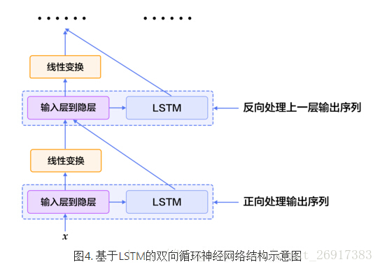
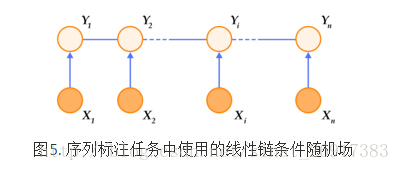
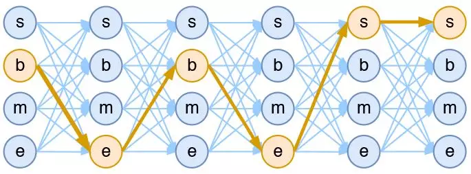

# RNN

## **原始 RNN**

CNN 这种网络架构的特点之一就是网络的状态仅依赖于输入，而 RNN 的状态不仅依赖于输入，且与网络上一时刻的状态有关。因此，经常用于处理序列相关的问题。RNN 的基础结构如下


可以看出，它跟 CNN、DNN 这种 Feedforward Neural Network 结构上的区别就在于：Feedforward NN 的结构是 DAG（有向无环图），而 Recurrent NN 的结构中至少有一个环。我们假设![[公式]](rnn.assets/equation.svg)的状态转移发生在时间维度上，则上图可以展开成以下形式：


于是我们可以写出其具体表达式：

![[公式]](rnn.assets/equation.svg)

其中，![[公式]](rnn.assets/equation.svg)表示![[公式]](rnn.assets/equation.svg)时刻的输入，![[公式]](rnn.assets/equation.svg)表示![[公式]](rnn.assets/equation.svg)时刻的输出，![[公式]](rnn.assets/equation.svg)表示![[公式]](rnn.assets/equation.svg)时刻 Hidden Layer 的状态。


**RNN与 BPTT**

RNN 的训练跟 CNN、DNN 本质一样，依然是 BP。但它的 BP 方法名字比较高级，叫做 BPTT（Back Propagation Through Time）。

我们首先回顾一下 DNN 相关概念。DNN 的结构如下图


而 DNN 的 BP 中最重要的公式如下（不再展开讲，不熟悉 BP 的同学请参考“[当我们在谈论 Deep Learning：DNN 与 Backpropagation](https://zhuanlan.zhihu.com/p/25794795)”）


有了以上 DNN 的结论，接下来我们将 RNN 沿着时间展开（UNFOLD），如下图


可以发现，UNFOLD 后的 RNN 其实跟 DNN 逻辑上是一样的，只是 DNN 中相邻层的连接在 RNN 中成了相邻时间的连接，所以公式也差不多。但有一点需要注意，对于某参数![[公式]](rnn.assets/equation-1598938979209.svg)，如果仅考虑第![[公式]](rnn.assets/equation.svg)时刻的 Loss ![[公式]](rnn.assets/equation-1598938979250.svg)，其梯度是 UNFOLD 后整个 BP 过程中的累加梯度，如以下公式。其中![[公式]](rnn.assets/equation-1598938979257.svg)表示![[公式]](rnn.assets/equation-1598938979209.svg)在时刻![[公式]](rnn.assets/equation-1598938979291.svg)的状态。

![[公式]](rnn.assets/equation-1598938979328.svg)

同理可得，如果考虑总误差![[公式]](rnn.assets/equation-1598938979342.svg)，则有

![[公式]](https://www.zhihu.com/equation?tex=%5Cbegin%7Balign%7D+%5Cfrac+%7B%5Cpartial+C%7D%7B%5Cpartial+%5Cbeta%7D+%26+%3D+%5Csum_%7Bj%3D1%7D%5E%7Bt%7D+%5Cfrac+%7B%5Cpartial+C%5Ej%7D%7B%5Cpartial+%5Cbeta%7D+%5Cfrac%7B%5Cpartial+C%7D%7B%5Cpartial+C%5Ej%7D+%5C%5C+%26+%3D+%5Csum_%7Bj%3D1%7D%5E%7Bt%7D+%5Csum_%7Bk%3D1%7D%5E%7Bj%7D+%5Cfrac%7B%5Cpartial+C%5Ej%7D%7B%5Cpartial+%5Cbeta%5Ek%7D+f%5E%7B%27%7D%28C%5Ej%29+%5C%5C+%5Cend%7Balign%7D)

上述公式如果用更形象的方式来描述，可以参考下面这张李宏毅老师的 PPT


现在我们只考虑![[公式]](https://www.zhihu.com/equation?tex=C%5Et)，则观察 UNFOLD 后的 RNN 网络结构，参考着 DNN 的 BP 公式，可以直接写出原始 RNN 的 BPTT 公式如下：

![[公式]](https://www.zhihu.com/equation?tex=%5Cbegin%7Balign%7D+%26+%5Cdelta%5E%7Bk-1%7D+%3D+%5Cfrac%7B%5Cpartial+C%5Et%7D%7B%5Cpartial+h%5E%7Bk-1%7D_%7B%2A%7D%7D+%3D+%28W_%7Bhh%7D%5ET+%5Cdelta%5E%7Bk%7D%29%E2%8A%99%5Csigma%5E%7B%5Cprime%7D%28h%5E%7Bk-1%7D_%7B%2A%7D%29+%5C%5C+%26+%5Cfrac%7B%5Cpartial+C%5Et%7D%7B%5Cpartial+w_%7Bij%7D%7D%3D+%5Csum_%7Bk%3D1%7D%5Et+%5Cfrac%7B%5Cpartial+h%5E%7Bk%7D_%7B%2Ai%7D%7D%7B%5Cpartial+w%5E%7Bk%7D_%7Bij%7D%7D+%5Cfrac%7B%5Cpartial+C%5Et%7D%7B%5Cpartial+h%5E%7Bk%7D_%7B%2Ai%7D%7D+%3D+%5Csum_%7Bk%3D1%7D%5Et+h%5E%7Bk-1%7D_%7Bj%7D+%5Cdelta%5E%7Bk%7D_i+%5C%5C+%5Cend%7Balign%7D)

**RNN 与 Gradient Vanish / Gradient Explode**

上面 RNN 的 BPTT 公式跟 DNN 的 BP 非常相似，所以毫无疑问同样会面临 Gradient Vanish 和 Gradient Explode 的问题。这里主要有两点原因：

Activation Function

对于上述公式中![[公式]](rnn.assets/equation-1598938979444.svg)，如果![[公式]](rnn.assets/equation-1598938979472.svg)为 sigmoid 函数或者 tanh 函数，根据![[公式]](rnn.assets/equation-1598938979478.svg)的递推式，当时间跨度较大时（对应于 DNN 中层数很深），![[公式]](rnn.assets/equation-1598938979478.svg)就会很小，从而使 BP 的梯度很小，产生 Gradient Vanish。解决方法也差不多，换一种 Activation Function，如 Relu 等

参数![[公式]](rnn.assets/equation-1598938979508.svg)

跟 DNN 中每层的![[公式]](rnn.assets/equation-1598938979660.svg)相对独立不同，RNN 中的![[公式]](rnn.assets/equation-1598938979508.svg)在每个时刻其实指的是同一个参数，所以![[公式]](rnn.assets/equation-1598938979478.svg)中会出现![[公式]](rnn.assets/equation-1598938979508.svg)的累乘。

当![[公式]](https://www.zhihu.com/equation?tex=W_%7Bhh%7D)为对角阵时，我们就有两点结论：

- 若某对角线元素小于1，则其幂次会趋近于0，进而导致 Gradient Vanish
- 若某对角线元素大于1，则其幂次会趋近于无穷大，进而导致 Gradient Explode


当然，![[公式]](https://www.zhihu.com/equation?tex=W_%7Bhh%7D)不一定是对角阵，如果其为非对角阵，我们就用实验的方式说明。首先我们对![[公式]](https://www.zhihu.com/equation?tex=W_%7Bhh%7D)的数值进行随机初始化。随后观察其累乘后数值分布随着幂次的变化趋势如下图。可以看出在多次累乘后，数值的分布有明显的趋势：要么趋近于0，要么趋近于绝对值很大的值。而这两种情况，就很可能会分别造成 Gradient Vanish 和 Gradient Explode


而解决 Gradient Vanish 和 Gradient Explode 的方法则有：

- 对于 Gradient Vanish，传统的方法也有效，比如换 Activation Function 等；不过一个更好的架构能更显著的缓解这个问题，比如下面会介绍的 LSTM、GRU
- 对于 Gradient Explode，一般处理方法就是将梯度限制在一定范围内，即 Gradient Clipping。可以是通过阈值，也可以做动态的放缩


**BRNN**

BRNN（Bi-directional RNN）由 Schuster 在"Bidirectional recurrent neural networks, 1997"中提出，是单向 RNN 的一种扩展形式。普通 RNN 只关注上文，而 BRNN 则同时关注上下文，能够利用更多的信息进行预测。

结构上， BRNN 由两个方向相反的 RNN 构成，这两个 RNN 连接着同一个输出层。这就达到了上述的同时关注上下文的目的。其具体结构图如下


BRNN 与普通 RNN 本质一样，仅在训练的步骤等细节上略有差别，这里不再详解描述。有兴趣的同学可以参考原文。

## **LSTM**

为了解决 Gradient Vanish 的问题，Hochreiter&Schmidhuber 在论文“Long short-term memory, 1997”中提出了 LSTM（Long Short-Term Memory）。原始的 LSTM 只有 Input Gate、Output Gate。而咱们现在常说的 LSTM 还有 Forget Gate，是由 Gers 在"Learning to Forget: Continual Prediction with LSTM, 2000"中提出的改进版本。后来，在"LSTM Recurrent Networks Learn Simple Context Free and Context Sensitive Languages, 2001"中 Gers 又加入了 Peephole Connection 的概念。同时，现在常用的深度学习框架 Tensorflow、Pytorch 等在实现 LSTM 上也有一些细微的区别。以上所说的虽然本质都是 LSTM，但结构上还是有所区别，在使用时需要注意一下。

下文介绍的 LSTM 是"Traditional LSTM with Forget Gates"版本。

**Traditional LSTM with Forget Gates**

LSTM 其实就是将 RNN 中 Hidden Layer 的一个神经元，用一个更加复杂的结构替换，称为 Memory Block。单个 Memory Block 的结构如下（图中的虚线为 Peephole Connection，忽略即可）


先对其中结构进行简要介绍：

- Input Gate, Output Gate, Forget Gate：这三个 Gate 本质上就是权值，形象点则类似电路中用于控制电流的开关。当值为1，表示开关闭合，流量无损耗流过；当值为0，表示开关打开，完全阻塞流量；当值介于(0,1)，则表示流量通过的程度。而这种![[公式]](rnn.assets/equation-1598938979718.svg)的取值，其实就是通过 Sigmoid 函数实现的
- Cell：Cell 表示当前 Memory Block 的状态，对应于原始 RNN 中的 Hidden Layer 的神经元
- Activation Function：图中多处出现了 Activation Function（小圆圈+ sigmoid 曲线的图案），对这些 Activation Function 的选择有一个通用的标准。一般，对 Input Gate, Output Gate, Forget Gate，使用的 Activation Function 是 sigmoid 函数；对于 Input 和 Cell， Activation Function 使用 tanh 函数


其具体公式如下：

![[公式]](https://www.zhihu.com/equation?tex=%5Cbegin%7Balign%7D+%26+i%5Et+%3D+sigmoid%28W_%7Bix%7D+x_t+%2B+W_%7Bih%7D+h_%7Bt-1%7D+%2B+b_%7Bi%7D%29+%5C%5C+%26+f%5Et+%3D+sigmoid%28W_%7Bfx%7D+x_t+%2B+W_%7Bfh%7D+h_%7Bt-1%7D+%2B+b_%7Bf%7D%29+%5C%5C+%26+g%5Et+%3D+%5Ctanh%28W_%7Bgx%7D+x_t+%2B+W_%7Bch%7D+h_%7Bt-1%7D+%2B+b_%7Bg%7D%29+%5C%5C+%26+o%5Et+%3D+sigmoid%28W_%7Box%7D+x_t+%2B+W_%7Boh%7D+h_%7Bt-1%7D+%2B+b_%7Bo%7D%29+%5C%5C+%26+c%5Et+%3D+f%5Et+%5Codot+c%5E%7Bt-1%7D+%2B+i%5Et+%E2%8A%99+g%5Et+%5C%5C+%26+h%5Et+%3D+o_t+%5Codot+%5Ctanh%28c_t%29+%5Cend%7Balign%7D)

其中，![[公式]](rnn.assets/equation-1598938979727.svg)分别表示 Input Gate, Output Gate, Forget Gate；![[公式]](rnn.assets/equation-1598938979774.svg)表示 Input；![[公式]](rnn.assets/equation.svg)表示 Output；![[公式]](rnn.assets/equation-1598938979848.svg)表示 Cell 在时刻![[公式]](rnn.assets/equation.svg)的状态；![[公式]](rnn.assets/equation-1598938979863.svg)表示向量 element-wise 的乘法（感谢 @雨辰 提醒）。

**LSTM 与 Gradient Vanish**

上面说到，LSTM 是为了解决 RNN 的 Gradient Vanish 的问题所提出的。关于 RNN 为什么会出现 Gradient Vanish，上面已经介绍的比较清楚了，本质原因就是因为矩阵高次幂导致的。下面简要解释一下为什么 LSTM 能有效避免 Gradient Vanish。

对于 LSTM，有如下公式

![[公式]](https://www.zhihu.com/equation?tex=c%5Et+%3D+f%5Et+%E2%8A%99+c%5E%7Bt-1%7D+%2B+i%5Et+%5Codot+g%5Et)

模仿 RNN，我们对 LSTM 计算![[公式]](rnn.assets/equation-1598938981184.svg)，有

![[公式]](rnn.assets/equation-1598938981210.svg)

公式里其余的项不重要，这里就用省略号代替了。可以看出当![[公式]](rnn.assets/equation-1598938981201.svg)时，就算其余项很小，梯度仍然可以很好地传导到上一个时刻，此时即使层数较深也不会发生 Gradient Vanish 的问题；当![[公式]](rnn.assets/equation-1598938981231.svg)时，即上一时刻的信号不影响到当前时刻，则此项也会为0；![[公式]](rnn.assets/equation-1598938981269.svg)在这里控制着梯度传导到上一时刻的衰减程度，与它 Forget Gate 的功能一致。

**LSTM 与 BPTT**

最初 LSTM 被提出时，其训练的方式为“Truncated BPTT”。大致的意思为，只有 Cell 的状态会 BP 多次，而其他部分的梯度会被截断，不 BP 到上一个时刻的 Memory Block。当然，这种方法现在也不使用了，所以仅此一提。

在"Framewise phoneme classification with bidirectional LSTM and other neural network architectures, 2005"中，作者提出了 Full Gradient BPTT 来训练 LSTM，也就是标准的 BPTT。这也是如今具有自动求导功能的开源框架们使用的方法。关于 LSTM 的 Full Gradient BPTT，我并没有推导过具体公式，有兴趣的同学可以参考 RNN 中 UNFOLD 的思想来试一试，这里也不再赘述了。

```python
import pandas as pd
from datetime import datetime
from matplotlib import pyplot
from sklearn.preprocessing import LabelEncoder,MinMaxScaler
from sklearn.metrics import mean_squared_error
from keras.models import Sequential
from keras.layers import Dense
from keras.layers import LSTM
from numpy import concatenate
from math import sqrt
 
# load data
def parse(x):
	return datetime.strptime(x, '%Y %m %d %H')
 
def read_raw():
    dataset = pd.read_csv('raw.csv',  parse_dates = [['year', 'month', 'day', 'hour']], index_col=0, date_parser=parse)
    dataset.drop('No', axis=1, inplace=True)
    # manually specify column names
    dataset.columns = ['pollution', 'dew', 'temp', 'press', 'wnd_dir', 'wnd_spd', 'snow', 'rain']
    dataset.index.name = 'date'
    # mark all NA values with 0
    dataset['pollution'].fillna(0, inplace=True)
    # drop the first 24 hours
    dataset = dataset[24:]
    # summarize first 5 rows
    print(dataset.head(5))
    # save to file
    dataset.to_csv('pollution.csv')
 
def drow_pollution():
    dataset = pd.read_csv('pollution.csv', header=0, index_col=0)
    values = dataset.values
    # specify columns to plot
    groups = [0, 1, 2, 3, 5, 6, 7]
    i = 1
    # plot each column
    pyplot.figure(figsize=(10,10))
    for group in groups:
    	pyplot.subplot(len(groups), 1, i)
    	pyplot.plot(values[:, group])
    	pyplot.title(dataset.columns[group], y=0.5, loc='right')
    	i += 1
    pyplot.show()
 
def series_to_supervised(data, n_in=1, n_out=1, dropnan=True):
     # convert series to supervised learning
    	n_vars = 1 if type(data) is list else data.shape[1]
    	df = pd.DataFrame(data)
    	cols, names = list(), list()
    	# input sequence (t-n, ... t-1)
    	for i in range(n_in, 0, -1):
    		cols.append(df.shift(i))
    		names += [('var%d(t-%d)' % (j+1, i)) for j in range(n_vars)]
    	# forecast sequence (t, t+1, ... t+n)
    	for i in range(0, n_out):
    		cols.append(df.shift(-i))
    		if i == 0:
    			names += [('var%d(t)' % (j+1)) for j in range(n_vars)]
    		else:
    			names += [('var%d(t+%d)' % (j+1, i)) for j in range(n_vars)]
    	# put it all together
    	agg = pd.concat(cols, axis=1)
    	agg.columns = names
    	# drop rows with NaN values
    	if dropnan:
    		agg.dropna(inplace=True)
    	return agg
    
def cs_to_sl():
    # load dataset
    dataset = pd.read_csv('pollution.csv', header=0, index_col=0)
    values = dataset.values
    # integer encode direction
    encoder = LabelEncoder()
    values[:,4] = encoder.fit_transform(values[:,4])
    # ensure all data is float
    values = values.astype('float32')
    # normalize features
    scaler = MinMaxScaler(feature_range=(0, 1))
    scaled = scaler.fit_transform(values)
    # frame as supervised learning
    reframed = series_to_supervised(scaled, 1, 1)
    # drop columns we don't want to predict
    reframed.drop(reframed.columns[[9,10,11,12,13,14,15]], axis=1, inplace=True)
    print(reframed.head())
    return reframed,scaler
    
def train_test(reframed):
    # split into train and test sets
    values = reframed.values
    n_train_hours = 365 * 24
    train = values[:n_train_hours, :]
    test = values[n_train_hours:, :]
    # split into input and outputs
    train_X, train_y = train[:, :-1], train[:, -1]
    test_X, test_y = test[:, :-1], test[:, -1]
    # reshape input to be 3D [samples, timesteps, features]
    train_X = train_X.reshape((train_X.shape[0], 1, train_X.shape[1]))
    test_X = test_X.reshape((test_X.shape[0], 1, test_X.shape[1]))
    print(train_X.shape, train_y.shape, test_X.shape, test_y.shape)
    return train_X,train_y,test_X,test_y
 
def fit_network(train_X,train_y,test_X,test_y,scaler):
    model = Sequential()
    model.add(LSTM(50, input_shape=(train_X.shape[1], train_X.shape[2])))
    model.add(Dense(1))
    model.compile(loss='mae', optimizer='adam')
    # fit network
    history = model.fit(train_X, train_y, epochs=50, batch_size=72, validation_data=(test_X, test_y), verbose=2, shuffle=False)
    # plot history
    pyplot.plot(history.history['loss'], label='train')
    pyplot.plot(history.history['val_loss'], label='test')
    pyplot.legend()
    pyplot.show()
    # make a prediction
    yhat = model.predict(test_X)
    test_X = test_X.reshape((test_X.shape[0], test_X.shape[2]))
    # invert scaling for forecast
    inv_yhat = concatenate((yhat, test_X[:, 1:]), axis=1)
    inv_yhat = scaler.inverse_transform(inv_yhat)
    inv_yhat = inv_yhat[:,0]
    # invert scaling for actual
    inv_y = scaler.inverse_transform(test_X)
    inv_y = inv_y[:,0]
    # calculate RMSE
    rmse = sqrt(mean_squared_error(inv_y, inv_yhat))
    print('Test RMSE: %.3f' % rmse)
    
if __name__ == '__main__':
    drow_pollution()
    reframed,scaler = cs_to_sl()
    train_X,train_y,test_X,test_y = train_test(reframed)
    fit_network(train_X,train_y,test_X,test_y,scaler)
```


## **GRU**

GRU（Gated Recurrent Unit） 是由 K.Cho 在"Learning Phrase Representations using RNN Encoder–Decoder for Statistical Machine Translation, 2014"中提出的。它是 LSTM 的简化版本，但在大多数任务中其表现与 LSTM 不相伯仲，因此也成为了常用的 RNN 算法之一。

GRU 的具体结构与对应的公式如下：


![[公式]](rnn.assets/equation-1598938981384.svg)

其中，![[公式]](rnn.assets/equation-1598938981377.svg)分别被称为 Reset Gate 和 Update Gate。可以看出，GRU 与 LSTM 有一定的相似性，而区别主要在于：

1. LSTM 有三个 Gate，而 GRU 仅两个
2. GRU 没有 LSTM 中的 Cell，而是直接计算输出
3. GRU 中的 Update Gate 类似于 LSTM 中 Input Gate 和 Forget Gate 的融合；而观察它们结构中与上一时刻相连的 Gate，就能看出 LSTM 中的 Forget Gate 其实分裂成了 GRU 中的 Update Gate 和 Reset Gate

很多实验都表明 GRU 跟 LSTM 的效果差不多，而 GRU 有更少的参数，因此相对容易训练且过拟合的问题要轻一点，在训练数据较少时可以试试。


## Stacked LSTM 及其问题


如果单层 LSTM 表达能力不够，通常会使用 Stacking 把多层 LSTM 摞起来，下层的输出作为上层的输入，进而增强模型的表达能力。乍一看似乎没什么问题（事实上这是目前的主流做法），但是其实这很不符合直觉啊。我个人能接受 Vanilla RNN 和 GRU 堆叠多层，但是 LSTM 堆叠多层就显得很奇怪了（虽然说效果还不错）。

我的理由是这样的：如果从直觉上讲，input gate 用于控制模型读入多少信息，output gate 用于控制模型输出多少信息，那么**两层 LSTM 嵌套在一起的时候，当下层 LSTM 的信息要流动到上层时，需要先经过下层的 output gate 筛选一次，再经过上层的 input gate 筛选一次，这是何必呢？**难道不应该底层把所有信息都暴露给上层对于上层做决定更有利吗，或者至少是让上层决定它自己需要什么信息？简单用流程图解释下：


**普通 LSTM 的信息流动**（方括号表示在同一层内部）：

单层：

输入 -> 【input gate 选择后的信息 -> c -> output gate 选择后的信息】 -> 输出

双层或多层：

输入 -> 【input gate 选择后的信息 -> c -> output gate 选择后的信息】 -> 【input gate 选择后的信息 -> c -> output gate 选择后的信息】 -> 输出


**可是，是不是下面这样的结构更好呢？**（未验证，仅为脑洞）

单层（此时与普通的 LSTM 等价，就看认为 c 和输出之间的门属于哪一层）：

输入 -> 【input gate 选择后的信息 -> c 】-> 【输出层自己的 input gate 选择后的信息 -> 输出】

双层或多层：

输入 -> 【input gate 选择后的信息 -> c】 -> 【input gate 选择后的信息 -> c】-> 【输出层 input gate 选择后的信息 -> 输出】


这样一来，在多层的情形下，就少了中间几个隐层的 input gate 和 output gate 重复选择的问题，还能减少参数量。

从另一个角度讲，给输出层加一个 gate 可以看成是近年来流行的 deep out：即在隐层输出的基础上，再变换个好几层作为模型最终的输出。这里的好几层多出来的变换就可以认为是输出层的 input gate（只是没有文献这么叫罢了），用于提取整合 RNN 的输出中和当前时间步有关的信息。

```python
from keras.models import Sequential
from keras.layers import LSTM, Dense
import numpy as np

data_dim = 16
timesteps = 8
num_classes = 10

# expected input data shape: (batch_size, timesteps, data_dim)
model = Sequential()
model.add(LSTM(32, return_sequences=True,
               input_shape=(timesteps, data_dim)))  # returns a sequence of vectors of dimension 32
model.add(LSTM(32, return_sequences=True))  # returns a sequence of vectors of dimension 32
model.add(LSTM(32))  # return a single vector of dimension 32
model.add(Dense(10, activation='softmax'))

model.compile(loss='categorical_crossentropy',
              optimizer='rmsprop',
              metrics=['accuracy'])

# Generate dummy training data
x_train = np.random.random((1000, timesteps, data_dim))
y_train = np.random.random((1000, num_classes))

# Generate dummy validation data
x_val = np.random.random((100, timesteps, data_dim))
y_val = np.random.random((100, num_classes))

model.fit(x_train, y_train,
          batch_size=64, epochs=5,
          validation_data=(x_val, y_val))
```

 

## 双向循环神经网络（Bidirectional Recurrent Neural Network）

在LSTM中，t时刻的隐藏层向量编码了到t时刻为止所有输入的信息，但t时刻的LSTM可以看到历史，却无法看到未来。在绝大多数自然语言处理任务中，我们几乎总是能拿到整个句子。这种情况下，如果能够像获取历史信息一样，得到未来的信息，对序列学习任务会有很大的帮助。

为了克服这一缺陷，我们可以设计一种双向循环网络单元，它的思想简单且直接：对上一节的栈式循环神经网络进行一个小小的修改，堆叠多个LSTM单元，让每一层LSTM单元分别以：正向、反向、正向 …… 的顺序学习上一层的输出序列。于是，从第2层开始，t时刻我们的LSTM单元便总是可以看到历史和未来的信息。图4是基于LSTM的双向循环神经网络结构示意图。



需要说明的是，这种双向RNN结构和Bengio等人在机器翻译任务中使用的双向RNN结构并不相同 

```python
#在 IMDB 情感分类任务上训练双向 LSTM
from __future__ import print_function
import numpy as np

from keras.preprocessing import sequence
from keras.models import Sequential
from keras.layers import Dense, Dropout, Embedding, LSTM, Bidirectional
from keras.datasets import imdb


max_features = 20000
# 在此数量的单词之后剪切文本（取最常见的 max_features 个单词）
maxlen = 100
batch_size = 32

print('Loading data...')
(x_train, y_train), (x_test, y_test) = imdb.load_data(num_words=max_features)
print(len(x_train), 'train sequences')
print(len(x_test), 'test sequences')

print('Pad sequences (samples x time)')
x_train = sequence.pad_sequences(x_train, maxlen=maxlen)
x_test = sequence.pad_sequences(x_test, maxlen=maxlen)
print('x_train shape:', x_train.shape)
print('x_test shape:', x_test.shape)
y_train = np.array(y_train)
y_test = np.array(y_test)

model = Sequential()
model.add(Embedding(max_features, 128, input_length=maxlen))
model.add(Bidirectional(LSTM(64)))
model.add(Dropout(0.5))
model.add(Dense(1, activation='sigmoid'))

# 尝试使用不同的优化器和优化器配置
model.compile('adam', 'binary_crossentropy', metrics=['accuracy'])

print('Train...')
model.fit(x_train, y_train,
          batch_size=batch_size,
          epochs=4,
          validation_data=[x_test, y_test])
```


## 条件随机场 (Conditional Random Field)

使用神经网络模型解决问题的思路通常是：前层网络学习输入的特征表示，网络的最后一层在特征基础上完成最终的任务。在SRL任务中，深层LSTM网络学习输入的特征表示，条件随机场（Conditional Random Filed， CRF）在特征的基础上完成序列标注，处于整个网络的末端。 
序列标注任务只需要考虑输入和输出都是一个线性序列，并且由于我们只是将输入序列作为条件，不做任何条件独立假设，因此输入序列的元素之间并不存在图结构。综上，在序列标注任务中使用的是如图5所示的定义在链式图上的CRF，称之为线性链条件随机场（Linear Chain Conditional Random Field）。 


### 图示

按照之前的思路，我们依旧来对比一下普通的逐帧 softmax 和 CRF 的异同。 

**逐帧softmax**

CRF 主要用于序列标注问题，可以简单理解为是**给序列中的每一帧都进行分类**，既然是分类，很自然想到将这个序列用 CNN 或者 RNN 进行编码后，接一个全连接层用 softmax 激活，如下图所示：


**▲** 逐帧softmax并没有直接考虑输出的上下文关联

**条件随机场**

然而，当我们设计标签时，比如用 s、b、m、e 的 4 个标签来做字标注法的分词，目标输出序列本身会带有一些上下文关联，比如 s 后面就不能接 m 和 e，等等。逐标签 softmax 并没有考虑这种输出层面的上下文关联，所以它意味着把这些关联放到了编码层面，希望模型能自己学到这些内容，但有时候会“强模型所难”。 

而 CRF 则更直接一点，它**将输出层面的关联分离了出来**，这使得模型在学习上更为“从容”：


**▲** CRF在输出端显式地考虑了上下文关联

### 数学

当然，如果仅仅是引入输出的关联，还不仅仅是 CRF 的全部，CRF 的真正精巧的地方，是它以路径为单位，考虑的是路径的概率。 

**模型概要**

假如一个输入有 n 帧，每一帧的标签有 k 中可能性，那么理论上就有k^n中不同的输入。我们可以将它用如下的网络图进行简单的可视化。在下图中，每个点代表一个标签的可能性，点之间的连线表示标签之间的关联，而每一种标注结果，都对应着图上的一条完整的路径。



**▲** 4tag分词模型中输出网络图

而在序列标注任务中，我们的正确答案是一般是唯一的。比如“今天天气不错”，如果对应的分词结果是“今天/天气/不/错”，那么目标输出序列就是 bebess，除此之外别的路径都不符合要求。

换言之，在序列标注任务中，我们的研究的基本单位应该是路径，我们要做的事情，是从 k^n 条路径选出正确的一条，那就意味着，如果将它视为一个分类问题，那么将是 k^n 类中选一类的分类问题。

这就是逐帧 softmax 和 CRF 的根本不同了：**前者将序列标注看成是 n 个 k 分类问题，后者将序列标注看成是 1 个 k^n 分类问题**。

具体来讲，在 CRF 的序列标注问题中，我们要计算的是条件概率：


为了得到这个概率的估计，CRF 做了两个假设：

**假设一：该分布是指数族分布。**

这个假设意味着存在函数 f(y1,…,yn;x)，使得：


其中 Z(x) 是归一化因子，因为这个是条件分布，所以归一化因子跟 x 有关。这个 f 函数可以视为一个打分函数，打分函数取指数并归一化后就得到概率分布。 

**假设二：输出之间的关联仅发生在相邻位置，并且关联是指数加性的。**

这个假设意味着 f(y1,…,yn;x) 可以更进一步简化为：


这也就是说，现在我们只需要对每一个标签和每一个相邻标签对分别打分，然后将所有打分结果求和得到总分。

**线性链CRF**

尽管已经做了大量简化，但一般来说，(3) 式所表示的概率模型还是过于复杂，难以求解。于是考虑到当前深度学习模型中，RNN 或者层叠 CNN 等模型已经能够比较充分捕捉各个 y 与输出 x 的联系，因此，我们不妨考虑函数 g 跟 x 无关，那么：


这时候 g 实际上就是一个有限的、待训练的参数矩阵而已，而单标签的打分函数 h(yi;x) 我们可以通过 RNN 或者 CNN 来建模。因此，该模型是可以建立的，其中概率分布变为：


这就是线性链 CRF 的概念。

**归一化因子**

为了训练 CRF 模型，我们用最大似然方法，也就是用：


作为损失函数，可以算出它等于：


其中第一项是原来概率式的**分子**的对数，它目标的序列的打分，虽然它看上去挺迂回的，但是并不难计算。真正的难度在于**分母**的对数 logZ(x) 这一项。

归一化因子，在物理上也叫配分函数，在这里它需要我们对所有可能的路径的打分进行指数求和，而我们前面已经说到，这样的路径数是指数量级的（k^n），因此直接来算几乎是不可能的。

事实上，**归一化因子难算，几乎是所有概率图模型的公共难题**。幸运的是，在 CRF 模型中，由于我们只考虑了临近标签的联系（马尔可夫假设），因此我们可以递归地算出归一化因子，这使得原来是指数级的计算量降低为线性级别。

具体来说，我们将计算到时刻 t 的归一化因子记为 Zt，并将它分为 k 个部分：


其中分别是截止到当前时刻 t 中、以标签 1,…,k 为终点的所有路径的得分指数和。那么，我们可以递归地计算：


它可以简单写为矩阵形式：


其中，而 G 是对 g(yi,yj) 各个元素取指数后的矩阵，即；而是编码模型（RNN、CNN等）对位置 t+1 的各个标签的打分的指数，即，也是一个向量。式 (10) 中，ZtG 这一步是矩阵乘法，得到一个向量，而 ⊗ 是两个向量的逐位对应相乘。


**▲** 归一化因子的递归计算图示。从t到t+1时刻的计算，包括转移概率和j+1节点本身的概率

如果不熟悉的读者，可能一下子比较难接受 (10) 式。读者可以把 n=1,n=2,n=3 时的归一化因子写出来，试着找它们的递归关系，慢慢地就可以理解 (10) 式了。

**动态规划**

写出损失函数 −logP(y1,…,yn|x) 后，就可以完成模型的训练了，因为目前的深度学习框架都已经带有自动求导的功能，只要我们能写出可导的 loss，就可以帮我们完成优化过程了。 

那么剩下的最后一步，就是模型训练完成后，如何根据输入找出最优路径来。跟前面一样，这也是一个从 k^n 条路径中选最优的问题，而同样地，因为马尔可夫假设的存在，它可以转化为一个动态规划问题，用 viterbi 算法解决，计算量正比于 n。 

动态规划在本博客已经出现了多次了，**它的递归思想就是：一条最优路径切成两段，那么每一段都是一条（局部）最优路径**。在本博客右端的搜索框键入“动态规划”，就可以得到很多相关介绍了，所以不再重复了。

### 实现

经过调试，基于 Keras 框架下，笔者得到了一个线性链 CRF 的简明实现，**这也许是最简短的 CRF 实现了**。这里分享最终的实现并介绍实现要点。

**实现要点**

前面我们已经说明了，实现 CRF 的困难之处是 −logP(y1,…,yn|x) 的计算，而本质困难是归一化因子部分 Z(x) 的计算，得益于马尔科夫假设，我们得到了递归的 (9) 式或 (10) 式，它们应该已经是一般情况下计算 Z(x) 的计算了。 

那么怎么在深度学习框架中实现这种递归计算呢？要注意，从计算图的视角看，这是通过递归的方法定义一个图，而且这个图的长度还不固定。这对于 PyTorch这样的动态图框架应该是不为难的，但是对于TensorFlow或者基于 TensorFlow 的 Keras 就很难操作了（它们是静态图框架）。 

不过，并非没有可能，**我们可以用封装好的 RNN 函数来计算**。我们知道，RNN 本质上就是在递归计算：


新版本的 TensorFlow 和 Keras 都已经允许我们自定义 RNN 细胞，这就意味着函数 f 可以自行定义，而后端自动帮我们完成递归计算。**于是我们只需要设计一个 RNN，使得我们要计算的 Z 对应于 RNN 的隐藏向量**。

这就是 CRF 实现中最精致的部分了。

至于剩下的，是一些细节性的，包括：

\1. 为了防止溢出，我们通常要取对数，但由于归一化因子是指数求和，所以实际上是这样的格式，它的计算技巧是：


TensorFlow 和 Keras 中都已经封装好了对应的 logsumexp 函数了，直接调用即可；

\2. 对于分子（也就是目标序列的得分）的计算技巧，在代码中已经做了注释，主要是通过用“目标序列”点乘“预测序列”来实现取出目标得分；

\3. 关于变长输入的 padding 部分如何进行 mask？我觉得在这方面 Keras 做得并不是很好。

为了简单实现这种 mask，我的做法是引入多一个标签，比如原来是 s、b、m、e 四个标签做分词，然后引入第五个标签，比如 x，将 padding 部分的标签都设为 x，然后可以直接在 CRF 损失计算时忽略第五个标签的存在，具体实现请看代码。

**代码速览**

纯 Keras 实现的 CRF 层，欢迎使用。

```python
# -*- coding:utf-8 -*-

from keras.layers import Layer
import keras.backend as K


class CRF(Layer):
    """纯Keras实现CRF层
    CRF层本质上是一个带训练参数的loss计算层，因此CRF层只用来训练模型，
    而预测则需要另外建立模型。
    """
    def __init__(self, ignore_last_label=False, **kwargs):
        """ignore_last_label：定义要不要忽略最后一个标签，起到mask的效果
        """
        self.ignore_last_label = 1 if ignore_last_label else 0
        super(CRF, self).__init__(**kwargs)
    def build(self, input_shape):
        self.num_labels = input_shape[-1] - self.ignore_last_label
        self.trans = self.add_weight(name='crf_trans',
                                     shape=(self.num_labels, self.num_labels),
                                     initializer='glorot_uniform',
                                     trainable=True)
    def log_norm_step(self, inputs, states):
        """递归计算归一化因子
        要点：1、递归计算；2、用logsumexp避免溢出。
        技巧：通过expand_dims来对齐张量。
        """
        states = K.expand_dims(states[0], 2) # (batch_size, output_dim, 1)
        trans = K.expand_dims(self.trans, 0) # (1, output_dim, output_dim)
        output = K.logsumexp(states+trans, 1) # (batch_size, output_dim)
        return output+inputs, [output+inputs]
    def path_score(self, inputs, labels):
        """计算目标路径的相对概率（还没有归一化）
        要点：逐标签得分，加上转移概率得分。
        技巧：用“预测”点乘“目标”的方法抽取出目标路径的得分。
        """
        point_score = K.sum(K.sum(inputs*labels, 2), 1, keepdims=True) # 逐标签得分
        labels1 = K.expand_dims(labels[:, :-1], 3)
        labels2 = K.expand_dims(labels[:, 1:], 2)
        labels = labels1 * labels2 # 两个错位labels，负责从转移矩阵中抽取目标转移得分
        trans = K.expand_dims(K.expand_dims(self.trans, 0), 0)
        trans_score = K.sum(K.sum(trans*labels, [2,3]), 1, keepdims=True)
        return point_score+trans_score # 两部分得分之和
    def call(self, inputs): # CRF本身不改变输出，它只是一个loss
        return inputs
    def loss(self, y_true, y_pred): # 目标y_pred需要是one hot形式
        mask = 1-y_true[:,1:,-1] if self.ignore_last_label else None
        y_true,y_pred = y_true[:,:,:self.num_labels],y_pred[:,:,:self.num_labels]
        init_states = [y_pred[:,0]] # 初始状态
        log_norm,_,_ = K.rnn(self.log_norm_step, y_pred[:,1:], init_states, mask=mask) # 计算Z向量（对数）
        log_norm = K.logsumexp(log_norm, 1, keepdims=True) # 计算Z（对数）
        path_score = self.path_score(y_pred, y_true) # 计算分子（对数）
        return log_norm - path_score # 即log(分子/分母)
    def accuracy(self, y_true, y_pred): # 训练过程中显示逐帧准确率的函数，排除了mask的影响
        mask = 1-y_true[:,:,-1] if self.ignore_last_label else None
        y_true,y_pred = y_true[:,:,:self.num_labels],y_pred[:,:,:self.num_labels]
        isequal = K.equal(K.argmax(y_true, 2), K.argmax(y_pred, 2))
        isequal = K.cast(isequal, 'float32')
        if mask == None:
            return K.mean(isequal)
        else:
            return K.sum(isequal*mask) / K.sum(mask)
```

除去注释和 accuracy 的代码，真正的 CRF 的代码量也就 30 行左右，可以说跟哪个框架比较都称得上是简明的 CRF 实现了。

用纯 Keras 实现一些复杂的模型，是一件颇有意思的事情。目前仅在 TensorFlow 后端测试通过，理论上兼容 Theano、CNTK 后端，但可能要自行微调。 


## 深度双向LSTM（DB-LSTM）SRL模型

在SRL任务中，输入是 “谓词” 和 “一句话”，目标是从这句话中找到谓词的论元，并标注论元的语义角色。如果一个句子含有n个谓词，这个句子会被处理n次。一个最为直接的模型是下面这样：

- 构造输入；
- 输入1是谓词，输入2是句子 将输入1扩展成和输入2一样长的序列，用one-hot方式表示；
- one-hot方式的谓词序列和句子序列通过词表，转换为实向量表示的词向量序列；
- 将步骤2中的2个词向量序列作为双向LSTM的输入，学习输入序列的特征表示；
- CRF以步骤3中模型学习到的特征为输入，以标记序列为监督信号，实现序列标注；

大家可以尝试上面这种方法。这里，我们提出一些改进，引入两个简单但对提高系统性能非常有效的特征：

- 谓词上下文：上面的方法中，只用到了谓词的词向量表达谓词相关的所有信息，这种方法始终是非常弱的，特别是如果谓词在句子中出现多次，有可能引起一定的歧义。从经验出发，谓词前后若干个词的一个小片段，能够提供更丰富的信息，帮助消解歧义。于是，我们把这样的经验也添加到模型中，为每个谓词同时抽取一个“谓词上下文” 片段，也就是从这个谓词前后各取n个词构成的一个窗口片段；
- 谓词上下文区域标记：为句子中的每一个词引入一个0-1二值变量，表示它们是否在“谓词上下文”片段中；

修改后的模型如下（图6是一个深度为4的模型结构示意图）：

- 构造输入
- 输入1是句子序列，输入2是谓词序列，输入3是谓词上下文，从句子中抽取这个谓词前后各n个词，构成谓词上下文，用one-hot方式表示，输入4是谓词上下文区域标记，标记了句子中每一个词是否在谓词上下文中；
- 将输入2~3均扩展为和输入1一样长的序列；
- 输入1~4均通过词表取词向量转换为实向量表示的词向量序列；其中输入1、3共享同一个词表，输入2和4各自独有词表；
- 第2步的4个词向量序列作为双向LSTM模型的输入；LSTM模型学习输入序列的特征表示，得到新的特性表示序列；
- CRF以第3步中LSTM学习到的特征为输入，以标记序列为监督信号，完成序列标注；


------

## Nested LSTM

最近有一篇文章提出了 Nested LSTMs，从信息隐匿的角度讲，我觉得更符合 LSTM 的设计思路。LSTM 不是把 (c, h) 分开了吗？c 和 h 不是地位不对等吗？好，既然 h 构建在 c 的上层，那我就给 c 的底层再加一个更基础的模块。例如，在写一篇文章时，h 用于预测当前词，c 用于存储当前这句话中有用的信息，再定义一个比 c 更底层的模块存储 
![[公式]](https://www.zhihu.com/equation?tex=%5Ctilde%7Bc%7D) 
当前段落的主题，再有一个更更底层的模块存储整篇文章的主题，这种设计如何？你不是喜欢藏信息吗，那我让你藏个够！

每一层的 c 都是一层新的抽象，表达时间跨度更大的信息，当模型想做一次预测时，一层一层往深里查询，h 去查 c，c 去查 
![[公式]](rnn.assets/equation-1598939595230.svg) 
，就好像函数调用一样，层层上报，层层审批，最终把需要的信息从最深层提取出来，而且是糅合了不同深度（对应于不同的时间尺度）的信息。


图示如下：

Nested LSTM


三种结构的计算图对比如下的：

各 LSTM 变体计算图

就作者自己的一些观察而言，也确实是更内层的 cell 变化更慢一些，也即对应了更大时间尺度的信息，和模型设计的初衷相一致。

## Encoder-Decoder模型及RNN的实现

所谓**encoder-decoder模型，又叫做编码-解码模型。这是一种应用于seq2seq问题的模型**。

那么seq2seq又是什么呢？简单的说，就是根据一个输入序列x，来生成另一个输出序列y。seq2seq有很多的应用，例如翻译，文档摘取，问答系统等等。在翻译中，输入序列是待翻译的文本，输出序列是翻译后的文本；在问答系统中，输入序列是提出的问题，而输出序列是答案。

为了解决seq2seq问题，有人提出了encoder-decoder模型，也就是编码-解码模型。所谓编码，就是将输入序列转化成一个固定长度的向量；解码，就是将之前生成的固定向量再转化成输出序列。


当然了，这个只是大概的思想，具体实现的时候，编码器和解码器都不是固定的,可选的有CNN/RNN/BiRNN/GRU/LSTM等等，你可以自由组合。比如说，你在编码时使用BiRNN,解码时使用RNN，或者在编码时使用RNN,解码时使用LSTM等等。

**encoder-decoder模型虽然非常经典，但是局限性也非常大**。最大的局限性就在于编码和解码之间的唯一联系就是一个固定长度的语义向量C。也就是说，编码器要将整个序列的信息压缩进一个固定长度的向量中去。但是这样做有两个弊端，一是语义向量无法完全表示整个序列的信息，还有就是先输入的内容携带的信息会被后输入的信息稀释掉，或者说，被覆盖了。输入序列越长，这个现象就越严重。这就使得在解码的时候一开始就没有获得输入序列足够的信息， 那么解码的准确度自然也就要打个折扣了.

```python
from random import randint
from numpy import array, argmax, array_equal
from keras.utils import to_categorical
from keras.models import Model
from keras.layers import Input, LSTM, Dense

# generate a sequence of random integers
def generate_sequence(length, n_unique):
    return [randint(1, n_unique-1) for _ in range(length)]


# prepare data for the LSTM
def get_dataset(n_in, n_out, cardinality, n_samples):
    X1, X2, y = list(), list(), list()
    for _ in range(n_samples):
        # generate source sequence
        source = generate_sequence(n_in, cardinality)
        # define padded target sequence
        target = source[:n_out]
        target.reverse()
        # create padded input target sequence
        target_in = [0] + target[:-1]
        # encode
        src_encoded = to_categorical(source, num_classes=cardinality)
        tar_encoded = to_categorical(target, num_classes=cardinality)
        tar2_encoded = to_categorical(target_in, num_classes=cardinality)
        # store
        X1.append(src_encoded)
        X2.append(tar2_encoded)
        y.append(tar_encoded)
    return array(X1), array(X2), array(y)


# returns train, inference_encoder and inference_decoder models
def define_models(n_input, n_output, n_units):
    # 定义训练编码器
    encoder_inputs = Input(shape=(None, n_input))  # n_input表示特征这一维(维的大小即特征的数目，如图像的feature map)
    encoder = LSTM(n_units, return_state=True)  # 编码器的特征维的大小dimension(n),即单元数。
    encoder_outputs, state_h, state_c = encoder(encoder_inputs) # 取出输入生成的隐藏状态和细胞状态，作为解码器的隐藏状态和细胞状态的初始化值。
    # 定义训练解码器
    decoder_inputs = Input(shape=(None, n_output))   # n_output：输出响应序列的特征维的大小。
    decoder_lstm = LSTM(n_units, return_sequences=True, return_state=True)  # 因解码器用编码器的隐藏状态和细胞状态，所以n_units必等
    decoder_outputs, _, _ = decoder_lstm(decoder_inputs, initial_state=[state_h, state_c])  # 这个解码层在后面推断中会被共享！！

    decoder_dense = Dense(n_output, activation='softmax')    # 这个full层在后面推断中会被共享！！
    decoder_outputs = decoder_dense(decoder_outputs)
    model = Model([encoder_inputs, decoder_inputs], decoder_outputs)  # 得到以输入序列和目标序列作为输入，以目标序列的移位为输出的训练模型

    # 定义推断编码器  根据输入序列得到隐藏状态和细胞状态的路径图，得到模型，使用的输入到输出之间所有层的权重，与tf的预测签名一样
    encoder_model = Model(encoder_inputs, [state_h, state_c])   # 层编程模型很简单，只要用Model包住其输入和输出即可。
    #encoder_outputs, state_h, state_c = encoder(encoder_inputs)  # ？ 似乎就是上面的
    # 定义推断解码器，由于循环网络的性质，由输入状态(前)推理出输出状态(后)。
    decoder_state_input_h = Input(shape=(n_units,))
    decoder_state_input_c = Input(shape=(n_units,))

    decoder_outputs, state_h, state_c = decoder_lstm(decoder_inputs, initial_state=[decoder_state_input_h, decoder_state_input_c])
    decoder_outputs = decoder_dense(decoder_outputs)
    # 由老状态更新出新的状态
    decoder_model = Model([decoder_inputs, decoder_state_input_h, decoder_state_input_c], [decoder_outputs, state_h, state_c])
    # return all models
    return model, encoder_model, decoder_model


# generate target given source sequence
def predict_sequence(infenc, infdec, source, n_steps, cardinality):
    # encode
    h_state, c_state = infenc.predict(source)  # 根据输入计算该原输入在状态空间的取值
    # start of sequence input
    target_seq = array([0.0 for _ in range(cardinality)]).reshape(1, 1, cardinality)   # shape (1, 1, 51) [[[0,0,..]]] 一步
    # collect predictions
    output = list()
    for t in range(n_steps):
        # predict next char  这是递归网络的序列预测过程
        yhat,h_state, c_state = infdec.predict([target_seq, h_state, c_state])   # 获得循环地推的target_seq初始值，不停迭代产生新值
        # store prediction
        output.append(yhat[0, 0, :])
        # update state
        # update target sequence
        target_seq = yhat
    return array(output)

# decode a one hot encoded string
def one_hot_decode(encoded_seq):
    return [argmax(vector) for vector in encoded_seq]

# configure problem
n_features = 50 + 1
n_steps_in = 6
n_steps_out = 3
# define model
train, infenc, infdec = define_models(n_features, n_features, 128)
train.compile(optimizer='adam', loss='categorical_crossentropy', metrics=['acc'])  # 这一层需要被编译
# generate training dataset
X1, X2, y = get_dataset(n_steps_in, n_steps_out, n_features, 100000)
print(X1.shape,X2.shape,y.shape)
# train model
train.fit([X1, X2], y, epochs=1)
# evaluate LSTM
total, correct = 100, 0
# for _ in range(total):
#     X1, X2, y = get_dataset(n_steps_in, n_steps_out, n_features, 1)
#     target = predict_sequence(infenc, infdec, X1, n_steps_out, n_features)
#     if array_equal(one_hot_decode(y[0]), one_hot_decode(target)):
#         correct += 1
# print('Accuracy: %.2f%%' % (float(correct)/float(total)*100.0))
# spot check some examples
for _ in range(10):
    X1, X2, y = get_dataset(n_steps_in, n_steps_out, n_features, 1)
    target = predict_sequence(infenc, infdec, X1, n_steps_out, n_features)
    print('X=%s y=%s, yhat=%s' % (one_hot_decode(X1[0]), one_hot_decode(y[0]), one_hot_decode(target)))
```


------

## Attention模型

为了解决这个问题，作者提出了Attention模型，或者说注意力模型。简单的说，这种模型在产生输出的时候，还会产生一个“注意力范围”表示接下来输出的时候要重点关注输入序列中的哪些部分，然后根据关注的区域来产生下一个输出，如此往复。模型的大概示意图如下所示


相比于之前的encoder-decoder模型，attention模型最大的区别就在于它不在要求编码器将所有输入信息都编码进一个固定长度的向量之中。相反，此时编码器需要将输入编码成一个向量的序列，而在解码的时候，每一步都会选择性的从向量序列中挑选一个子集进行进一步处理。这样，在产生每一个输出的时候，都能够做到充分利用输入序列携带的信息。而且这种方法在翻译任务中取得了非常不错的成果。

### Attention原理

Attention的原理就是计算当前输入序列与输出向量的匹配程度，匹配度高也就是注意力集中点其相对的得分越高，其中Attention计算得到的匹配度权重，只限于当前序列对，不是像网络模型权重这样的整体权重。

### 算法过程：

1）encode对输入序列编码得到最后一个时间步的状态c，和每个时间步的输出h，其中c又作为decode的初始状态z0。

2）对于每个时间步的输出h与z0做匹配也就是match操作，得到每个时间步的匹配向量α01，如图1。


3）对所有时间步的输出h与z0的匹配度α0，使用softmax做归一化处理，得到各个时间步对于z0的匹配分数。

4）求各个时间步的输出h与匹配分数的加权求和得到c0，作为decode的下一个时间步的输入，如图2。


5）计算各个时间步的输出h与z1的匹配度得到c1作为decode下一个时间步的输入，如此一步一步重复下去，如图3。


这样就可以把每个时间步重要的信息传给decode中，以上就是Attention机制的处理过程。其中match操作一般是求两个向量的相似度，通常有如下方法：
1）余弦相似度
2）一个简单的 神经网络，输入为hh和ww，输出为α
3）或者矩阵变换α=hTWzα=hTWz (Multiplicative attention，Luong et al., 2015) 

在tensorflow1.0版本以后的api seq2seq库中，包含了两种Attention算法，他们的区别就是match操作的不同，因此也有人称他们为加法Attention和乘法Attention，具体内容下：

1）BahdanauAttention：论文https://arxiv.org/abs/1409.0473中的实现：


2）LuongAttention：论文https://arxiv.org/abs/1508.04025中的实现 ：


由于图片来自不同地方，所以符号有些不同，图4和图5中的h是上文所说的每个时间步的输出向量，d是decode中每个时间步的状态，也就是上文中的z，c是match后计算的权值加和后的向量用于decode中每个时间步的输入，a就是match操作中经过softmax后的匹配权重，v是一个向量，相当于w一样的权重需要去学习。有上面两个公式可以看出，BahdanauAttention和LuongAttention的区别就是在match过程中的计算方式不同，一个是将decode的状态与encode的输出求和，一个是求乘，所以才有了加法Attention和乘法Attention的叫法。

```python
def build_model():
    inputs = Input(shape=(input_dim,))

    # ATTENTION PART STARTS HERE
    attention_probs = Dense(input_dim, activation='softmax', name='attention_vec')(inputs)
    attention_mul =merge([inputs, attention_probs], output_shape=32, name='attention_mul', mode='mul')
    # ATTENTION PART FINISHES HERE

    attention_mul = Dense(64)(attention_mul)
    output = Dense(1, activation='sigmoid')(attention_mul)
    model = Model(input=[inputs], output=output)
    return model
```